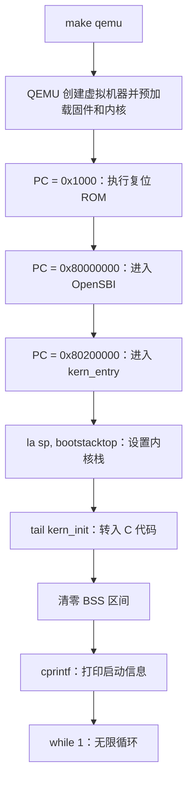

# 实验一学习指南与提示词

本文依据本目录的 [实验内容](内容/内容.txt)、[准备内容](内容/准备内容.txt)、当前源代码以及本机已有的真实调试记录整理。它用于帮助理解和完成实验，不代替个人复现与最终实验报告。

## 1. 这次实验需要如何研究代码，是否需要调整或补充代码？

**按照目前提供的要求，实验一主要是阅读、运行、调试和解释已有代码，没有明确要求你补全某个函数或实现新的算法。**

最小内核的主体代码已经提供。你需要亲手编译和运行它，用 GDB 观察启动过程，并说明“为什么这些代码能让一个内核运行起来”。如果现有工具与旧代码不兼容，可能需要少量环境适配；这不意味着要重新写一套内核。

| 明确要求 | 你要做什么 | 主要成果 |
| --- | --- | --- |
| 练习1 | 阅读 `entry.S`，解释 `la sp, bootstacktop` 和 `tail kern_init` 的操作及目的 | 有依据的文字分析 |
| 练习2 | 用 GDB 跟踪从复位到内核入口，解释最初指令的地址与功能 | 调试命令、实际观察、问题答案 |
| 报告要求 | 说明整体逻辑、核心模块、与 OS 原理的联系，以及尚未涉及的知识 | Markdown 报告 |
| 准备材料的考核说明 | 保存实际使用的提示词、代码及验证过程 | 提示词和过程记录 |
| 小组提交 | 将源码与报告提交到小组 GitHub/Gitee 仓库 | 可复现的提交版本 |

这里也需要澄清此前的工作：我已做的 `-kernel` 启动适配、入口段固定、SBI 汇编约束修正、整数边界修正，以及新增自检脚本，是环境适配和代码可靠性改进。**这些不是指导书新增的编程题，也不意味着你必须独立重写这些功能才能完成实验一。**具体改动见 [代码完成说明](docs/代码完成说明.md)。

当前 `make grade` 调用的是本次补充的本地自检，原始资源包没有提供对应脚本。它通过意味着已覆盖的检查通过，不能等同于老师评分通过，更不能代替报告。

## 2. 实验主要研究什么？

实验研究的问题是：**一个还没有其他操作系统为它提供运行环境的内核，怎样开始执行 C 代码，并在终端打印一句话？**

平时写普通 C 程序，编译器、链接器、操作系统加载器和 C 运行库已经帮助完成许多准备工作，你通常直接从 `main()` 开始理解程序。这里需要看见其中一些被隐藏的条件：代码放在哪里、CPU 从哪里开始执行、栈在哪里、全局零初始化数据由谁清零、打印字符又由谁负责。

实验成功时，内核只做三件事：完成必要初始化，打印 `(THU.CST) os is loading ...`，然后无限循环。它还没有用户程序、进程调度、文件系统或完整的内存管理。这个小结果已经能证明一条完整的启动和输出链路成立。

### 几个参与者分别负责什么

| 名称 | 本实验中的职责 | 在哪里运行/存在 |
| --- | --- | --- |
| Linux 宿主系统 | 运行编译器、QEMU、GDB 等开发工具 | 你的现有开发环境 |
| Conda `os2026` | 管理辅助工具环境，使调试器等命令可用 | Linux 上；不是 uCore 的运行时 |
| RISC-V 交叉编译器 | 在宿主机上生成 RISC-V 机器码 | Linux 上 |
| QEMU | 模拟 RISC-V CPU、内存和外设，预加载固件及内核 | Linux 上的程序 |
| 复位 ROM（MROM） | 提供虚拟 CPU 复位后最先执行的一小段代码 | 被模拟机器的 `0x1000` 附近 |
| OpenSBI | 初始化机器环境，将控制权交给内核，并提供 SBI 服务 | 被模拟机器内，主要运行在 M 模式 |
| uCore 最小内核 | 设置自己的栈，运行初始化和格式化输出 | 被模拟机器内，运行在 S 模式 |
| GDB | 通过 QEMU 调试接口观察和控制虚拟 CPU | Linux 上，远程调试目标是虚拟 CPU |

QEMU 的官方说明确认：`qemu-system-riscv64` 用于模拟 64 位 RISC-V 机器，`-bios default` 使用默认 OpenSBI，`-kernel` 指定内核。[QEMU RISC-V 文档](https://www.qemu.org/docs/master/system/target-riscv.html)

## 3. 核心流程：先构建，再启动，再输出

### 3.1 构建阶段：把源码变成可以加载的字节

```text
C 源文件 / 汇编源文件
          │  RISC-V GCC 编译和汇编
          ▼
         .o 目标文件
          │  ld 按 tools/kernel.ld 链接
          ▼
     bin/kernel：ELF 文件
          │  objcopy 转换
          ▼
     bin/ucore.img：原始二进制镜像
```

这一步发生在宿主机上，尚未启动 uCore。交叉编译的含义是：编译器在一种平台运行，生成另一种目标平台的机器码。生成的 RISC-V 内核不能作为普通 x86 Linux 应用直接执行。

`bin/kernel` 保留 ELF 结构和调试信息，供 GDB 识别函数、变量和源码位置；`bin/ucore.img` 是本次传给 QEMU 的原始镜像。**调试器读 ELF，模拟器按当前启动配置加载镜像，两者对应同一次构建。**

原始二进制镜像没有 ELF 那样的入口地址和段描述头。它应该加载到哪里，需要由启动方式和内核链接布局共同约定。也不要把 `ucore.img` 文件名中的 `.img` 理解成这里一定存在一块装有文件系统的虚拟硬盘。

### 3.2 启动阶段：CPU 的执行位置依次变化



必须把“装入内存”和“开始执行”分开理解：在当前 QEMU 启动方式下，内核镜像在 CPU 执行第一条指令之前就已经装入模拟内存；OpenSBI 初始化后，再把执行权交给内核。因此，在 PC 仍为 `0x1000` 时，GDB 已经能读到 `0x80200000` 的内核指令。

这也解释了为什么指导书建议的 `watch *0x80200000` 不一定能观察到装入瞬间：观察点设立时，装入可能已经完成。应结合内存内容、PC 和断点分析，不能只等观察点触发。预加载机制在本地材料第 222 行也有说明；QEMU 的加载与复位代码可在 [8.2.2 版本源码](https://raw.githubusercontent.com/qemu/qemu/v8.2.2/hw/riscv/boot.c) 中核对。

这里的三个地址对应当前 QEMU `virt` 平台与启动配置，不是所有 RISC-V 机器都必须使用的固定地址。

### 3.3 输出阶段：字符串怎样到达你的终端

```text
kern_init
  → cprintf：接收格式串和变长参数
  → vcprintf：整理输出调用和字符计数
  → vprintfmt：把 %s、%d 等转换成一个个字符
  → cputch：输出单个字符并计数
  → cons_putc：控制台封装
  → sbi_console_putchar：选择 SBI 字符输出服务
  → sbi_call：准备参数寄存器，执行 ecall
  → OpenSBI：处理服务并访问控制台设备
  → QEMU 模拟串口：将字符显示到宿主机终端
```

例如 `cprintf("n=%d", 12)`，上层格式化代码依次产生 `n`、`=`、`1`、`2`，底层接口只负责逐个输出字符。**格式化与设备输出被分开实现**，这是理解该模块最重要的一点。

## 4. 两个练习的原理，应该看懂到什么程度

### 4.1 练习1：为什么进入 C 之前要先设置栈

主要文件：[entry.S](kern/init/entry.S)、[memlayout.h](kern/mm/memlayout.h)、[mmu.h](kern/mm/mmu.h)。

入口代码的关键部分是：

```asm
kern_entry:
    la sp, bootstacktop
    tail kern_init
```

`sp` 是栈指针寄存器。普通 C 函数可能需要在栈上保存返回地址、局部变量、临时数据和部分寄存器。内核不能假设 OpenSBI 遗留的栈就是自己可以长期使用的栈，因此进入 C 代码前，要把 `sp` 指向内核自己的栈空间。

栈空间在哪里，来自同一个文件中的静态预留：

```asm
bootstack:
    .space KSTACKSIZE
bootstacktop:
```

当前 `KSTACKSIZE = 2 × 4096 = 8192` 字节。`.space` 在汇编布局中预留空间；`la` 在运行时把地址放进寄存器。**不能说 `la` 动态申请了 8 KiB 内存**，这两件事发生在不同阶段。

本机当前布局：

```text
高地址  0x80203000  ← bootstacktop，初始 sp，栈区上界
                    ↓ 建立栈帧时向低地址扩展
        ……          8 KiB 栈空间
低地址  0x80201000  ← bootstack，栈区下界
```

有效栈区是 `[bootstack, bootstacktop)`。初始 `sp` 指向上界，函数通常先减小 `sp` 再在栈帧内存取数据，因此并不是从栈顶地址开始向高地址写。

`la` 是“加载地址”的伪指令，通常需要多条真实机器指令。当前构建中，它展开为 `auipc sp, 0x3` 和 `mv sp, sp`；第二条反映这里的低位偏移为零。不能认为每条汇编源码都只对应一次 `si`。

`tail kern_init` 将控制流转移到 `kern_init`，不为这次转移建立新的返回地址。当前反汇编中是跳转指令 `j`。区别于普通 `call`，它不会把下一条地址写入 `ra`。这里 `kern_init` 被声明为不返回，并最终无限循环，因此不需要返回到入口汇编。

`noreturn` 是给编译器的信息，本身不是“让函数停住”的指令；真正让函数持续运行的是 `while (1)`。

你应能够用自己的话回答：栈由哪里预留，`sp` 何时改变，为什么先设置栈，`tail` 为什么适用，以及怎样通过寄存器和反汇编验证这些解释。

### 4.2 练习2：复位后最初执行什么

本机已有日志记录的第一组指令如下。此处是**复位 ROM，不是 uCore，也不是位于 `0x80000000` 的 OpenSBI 主体**。

| 地址 | 当前反汇编 | 作用 |
| --- | --- | --- |
| `0x1000` | `auipc t0, 0x0` | 把当前 PC 作为附近数据寻址的基准，此时 `t0 = 0x1000` |
| `0x1004` | `addi a2, t0, 40` | 准备动态固件信息的地址 `0x1028`，供后续固件使用 |
| `0x1008` | `csrr a0, mhartid` | 将当前硬件线程 hart 的标识放入参数寄存器 |
| `0x100c` | `ld a1, 32(t0)` | 从 ROM 附近的数据项读出设备树地址，传给固件 |
| `0x1010` | `ld t0, 24(t0)` | 读出下一阶段入口，本机是 `0x80000000` |
| `0x1014` | `jr t0` | 跳转到 OpenSBI |

注意 `ld a1, 32(t0)` 是“读取该位置保存的值”，不是把 `0x1020` 本身作为设备树地址。设备树描述机器的硬件配置，当前不要求你实现设备树解析器。

OpenSBI 随后完成运行环境初始化，并按约定向 S 模式内核交接。你不必单步读完 OpenSBI 的所有内部指令；应先理解复位 ROM，再设置内核入口断点，确认交接确实发生。

本机之前已观察到：

```text
复位：       pc = 0x1000
固件入口：   pc = 0x80000000
内核入口：   pc = 0x80200000
C 入口：     pc = 0x8020000a
栈初始化后： sp = 0x80203000
```

具体符号地址可能随着代码和工具链变化。报告应使用同一次构建的源码、ELF 和日志，不要混用指导书截图中的寄存器值。2026-09-30 完整交付的验证记录可见 [启动跟踪日志](docs/evidence/2026-09-30/gdb-startup.log)，这份归档不会随 `make clean` 被清除。

## 5. 除了两个练习，还应理解哪些模块

### 5.1 链接脚本：编译地址和加载地址必须一致

阅读 [kernel.ld](tools/kernel.ld)，重点理解下列内容：

| 语句/概念 | 你应该理解的含义 |
| --- | --- |
| `OUTPUT_ARCH(riscv)` | 输出目标体系结构 |
| `ENTRY(kern_entry)` | 设置 ELF 的入口符号 |
| `BASE_ADDRESS = 0x80200000` | 本内核链接布局的起始地址 |
| `. = BASE_ADDRESS` | 设置链接位置计数器；不是 CPU 执行的一条赋值指令 |
| `.text`、`.rodata`、`.data`、`.bss` | 分别组织代码、只读数据、已初始化可写数据和零初始化数据 |
| `ALIGN(0x1000)` | 对齐到 4096 字节的整数倍 |
| `edata`、`end` | 由链接器提供的边界符号，供初始化代码计算清零范围 |

仅仅写了 `ENTRY(kern_entry)`，不等于入口机器码一定是原始镜像的第一段字节；还需要正确安排段的位置。当前代码把 `.text.kern_entry` 放在 `.text` 的最前面，并用断言检查地址。

同样，链接器安排好地址不代表内存已经加载完成。链接发生在构建阶段，加载发生在启动阶段，两者要相互匹配。

### 5.2 `kern_init`：准备数据、输出、停留

阅读 [init.c](kern/init/init.c)。

`extern char edata[], end[]` 引用的是链接器符号，它们不是在这里新申请的两个数组。`memset(edata, 0, end - edata)` 用这些边界把需要零初始化的范围清零，补上本内核没有现成 C 运行库代做的工作。

当前正式构建中 `edata == end`，因此这次清零长度恰好为零。你需要理解清零机制，但不能声称已经用此日志验证了非空 BSS 的清零效果。原始镜像如何表示各段也应查看实际结果，不能笼统说“BSS 多大，bin 就一定增大多少”。

接着打印信息，最后无限循环。这个循环是实验的预期终点，不是调度器，也不等于机器已经关闭。

### 5.3 格式化输出：为什么不能直接使用 Linux 的 `printf`

阅读 [stdio.c](kern/libs/stdio.c)、[printfmt.c](libs/printfmt.c)、[console.c](kern/driver/console.c)、[sbi.c](libs/sbi.c)。

当前内核运行在自己的目标环境中，没有宿主 Linux 的 libc 和系统调用环境可供它直接使用。编译参数中的 `-nostdinc` 与本项目头文件搜索路径，使这里使用的是项目自带的 [stdio.h](libs/stdio.h)。

重点看懂变长参数怎样传给 `vprintfmt`，格式串怎样变成字符，字符怎样经回调进入底层输出接口。暂时不必逐个背诵所有格式标志或递归数字打印的每个分支。

### 5.4 SBI 与特权级：内核怎样请求固件服务

本实验运行过程中可以观察到两个主要层次：OpenSBI 在 M 模式，uCore 在 S 模式；尚未运行 U 模式用户程序。`ecall` 触发同步异常，由当前配置的处理路径将请求交给固件。它不是普通 C 函数调用，也不是时钟中断。

当前源码使用旧版 SBI 控制台接口：`a7` 放服务号，字符输出服务号为 `1`，`a0` 放字符；通用包装还准备 `a1/a2` 参数，并从 `a0` 获取返回结果。固件处理后返回内核，格式化代码继续处理下一个字符。[SBI 旧版接口规范](https://github.com/riscv-non-isa/riscv-sbi-doc/blob/master/src/ext-legacy.adoc)

SBI 是接口约定，OpenSBI 是它的一种实现。不要把“调用约定”和“实现该约定的固件”当成同一个概念。

对于 `sbi_call` 的内联汇编，先理解输入寄存器、输出寄存器和 `ecall` 的关系即可。当前修正后的写法把它们明确告诉编译器，避免手工改寄存器而编译器不知情。更深入的 GCC 约束细节可以作为扩展阅读。

## 6. 推荐的阅读与动手顺序

| 顺序 | 阅读/操作 | 完成标准 |
| --- | --- | --- |
| 1 | `kern/init/init.c`，运行 `make qemu` | 知道内核做什么，能区分 OpenSBI 横幅和内核输出 |
| 2 | `entry.S`、栈大小相关宏 | 能解释练习1的两条指令 |
| 3 | `kernel.ld`、Makefile 的构建部分 | 能说明地址、ELF、原始镜像与调试符号的关系 |
| 4 | Makefile 的 `debug/gdb`，亲自单步 | 能记录复位、固件和内核入口三个阶段 |
| 5 | 输出调用链 | 能说明字符串怎样变成终端字符 |
| 6 | 对照实验要求写报告 | 每个结论能指出代码或调试证据 |

第一轮可以略读 `tools/function.mk` 的复杂 Make 宏、`libs/riscv.h` 中暂未使用的寄存器封装，以及材料中进程、调度等后续内容。它们值得以后学，但不是本次理解启动链的前提。

### 一次最小手动实践

先启动内核看结果：

```bash
conda activate os2026
cd /home/lhl/os2026/lab1
make
make qemu
```

看到内核消息后，按 `Ctrl+A`，松开后按 `X` 退出。接着开启两个终端，均激活环境并进入 `lab1`。终端一运行 `make debug`，终端二运行 `make gdb`。

在刚连接的 GDB 中执行下面的命令，边执行边解释观察结果：

```gdb
set pagination off
info registers pc
x/6i 0x1000
x/3i 0x80200000
si 5
info registers pc a0 a1 a2 t0
si
info registers pc
b *0x80200000
c
x/3i $pc
info registers pc sp ra
si 2
info registers pc sp ra
p/x &bootstacktop
si
info registers pc sp ra
```

这组步数适用于当前已验证的构建。首次六条机器指令把 CPU 带到 OpenSBI；在内核入口，当前 `la` 展开两条机器指令，随后一条跳转进入 C。重新构建后先看反汇编，避免把步数当作通用规则。

| GDB 命令 | 用途 |
| --- | --- |
| `info registers` | 看 CPU 寄存器，而非猜测程序到了哪里 |
| `x/6i 地址` | 把指定位置解释为六条指令 |
| `si` | 执行一条真实机器指令 |
| `b *地址` | 在明确的指令地址设置断点 |
| `c` | 继续到下一个断点；不是单步 |
| `p/x &bootstacktop` | 以十六进制查看符号地址 |

`make debug` 中 `-S` 让 CPU 在启动时暂停，`-s` 提供 TCP 1234 调试端口。GDB 没有 OpenSBI 的源码符号时显示 `??` 并不表示程序失败，仍然可以按地址查看指令。

若需要保存新的日志，先在 shell 中建立 `docs/evidence`，然后在 GDB 中执行 `set logging file docs/evidence/gdb-manual.log` 和 `set logging enabled on`。已有日志使用新文件名保存，避免覆盖别人的证据。

自动复查可用 `make check`；学习时至少亲自做一遍手动跟踪。自动断言能帮你发现偏差，但不能替你理解寄存器为什么变化。

## 7. 最终应该掌握的知识边界

| 原理知识 | 本实验体现 | 还没有完成的部分 |
| --- | --- | --- |
| 指令执行与控制流 | PC 从复位 ROM 转到固件，再进入内核 | 多进程之间的上下文切换 |
| 函数调用约定 | `sp`、`ra`、参数寄存器和尾跳转 | 线程栈管理与线程切换 |
| 程序内存布局 | 各段、符号地址、栈预留和 BSS 清零 | 物理页分配、页表及按需分页 |
| 特权级与异常 | S 模式通过 SBI `ecall` 请求 M 模式服务 | 完整的用户程序系统调用和内核异常处理体系 |
| 硬件抽象与分层接口 | 格式化、控制台、SBI、设备逐层协作 | 通用驱动框架与完整文件系统 |
| 构建与可执行文件 | 交叉编译、链接和镜像转换 | 通用应用程序加载器 |

能回答下面的问题，就说明你掌握了本实验的主线：

1. `make` 与 `make qemu` 分别在哪个阶段起作用？
2. QEMU、OpenSBI 和 uCore 分别是什么？
3. 为什么 CPU 最初不是从 `kern_init` 开始执行？
4. `0x1000`、`0x80000000`、`0x80200000` 分别放什么？
5. 为什么“内存中已经有代码”不代表“CPU 已经执行到代码”？
6. `la` 设置的是地址还是从栈中取数据？栈空间是什么时候预留的？
7. `tail` 为什么不需要建立新的返回地址？
8. 谁提供 `edata/end`？为什么要清零？当前清了多少字节？
9. 原始镜像与 ELF 分别给谁使用？
10. 没有 libc，`cprintf` 怎样输出？哪个模块做格式转换？
11. `ecall` 与普通函数调用有什么不同？
12. 打印成功能证明什么，又不能证明哪些后续 OS 功能？

## 8. 怎样用提示词完成这次作业

### 8.1 先确定产出，再写四段式提示词

准备材料要求保留 `[PROMPT]`、`[RELY]`、`[GUARANTEE]`、`[SPECIFICATION]` 四段结构。关键是让 AI 明确任务、可信上下文、交付清单和可验证行为。

| 段落 | 本次作业里应写什么 |
| --- | --- |
| `[PROMPT]` | 是解释练习1、执行练习2、检查代码，还是整理报告；允许改哪些文件 |
| `[RELY]` | 两份要求文件、相关源码路径、当前环境和已存在日志；要求先阅读真实内容 |
| `[GUARANTEE]` | 分析任务列交付文件和必答问题；修改任务列真实接口及兼容要求 |
| `[SPECIFICATION]` | 操作前提、完成后的证据、正常/失败情况和验收条件 |

材料的示例偏重函数实现。本次分析任务可以保留四段结构，把“函数清单”合理转换成“分析对象和交付清单”，不要为了模仿示例而发明一个本来不需要实现的函数。

“帮我完成 lab1”没有说明完成标准，容易让 AI只生成泛泛说明，或者修改不需要修改的代码。更明确的目标是：“分析入口两条指令，并用当前 ELF 的反汇编与 GDB 寄存器变化证明解释。”

### 8.2 可直接使用的总任务提示词

下面这一段可以作为作业协助的开始。它将阅读分析、真实调试和报告整理串在一起，并保留必要的修改边界。

```text
[PROMPT]
任务：协助我完成 /home/lhl/os2026/lab1 的实验一作业，并帮助我理解。
请先核实练习要求，再按“入口分析 → 启动调试 → 输出链路 → 报告整理”开展。
操作要求：读取实际文件、执行必要验证、把结果写入实际 Markdown 文件。
本轮默认只新增文档和证据文件；发现阻碍任务的代码问题时，先给出证据和
最小修复方案，不为增加代码量重写内核。不要扩展后续实验功能。

[RELY]
要求文件：
- /home/lhl/os2026/lab1/内容/内容.txt
- /home/lhl/os2026/lab1/内容/准备内容.txt
相关代码：
- Makefile、tools/kernel.ld
- kern/init/entry.S、kern/init/init.c
- kern/mm/mmu.h、kern/mm/memlayout.h
- kern/libs/stdio.c、kern/driver/console.c
- libs/printfmt.c、libs/sbi.c、libs/sbi.h
环境：conda activate os2026；QEMU/GDB 已配置。
现有工具：make check、tools/boot.gdb；它们是本地辅助工具，不是官方评分。
请读取 docs/代码完成说明.md，识别已有修改，不将这些修改说成老师新增题目。

[GUARANTEE]
本轮没有预设必须修改的内核函数。
必须交付：
1. 练习1：两条入口指令的操作、目的、反汇编与寄存器证据。
2. 练习2：真实调试命令、复位指令解释和各启动阶段的观察。
3. 输出链路及核心模块分析。
4. 整体逻辑、OS 原理对应关系及本实验未覆盖的知识点。
5. lab1/实验报告-草稿.md，及 docs/evidence/ 下本轮新命名的日志。
若目标文档已存在，先读取并保留已有内容；不要覆盖他人的原始证据。

[SPECIFICATION]
Pre-Condition：先读取要求、源码和环境说明；先确认构建成功，再启动调试。
Post-Condition：全部练习问题都有答案，每个关键结论能追溯到源码或日志。
正常情况：
- 记录复位 PC、最初六条指令、OpenSBI 入口和内核入口。
- 对 la 的完整展开进行单步，核实 sp；核实 tail 的目标和 ra 的变化。
- 验证内核输出，说明其随后进入无限循环。
失败情况：
- 编译失败、连接失败、断点未到达时保留实际错误，不能编造成功记录。
- 区分已经观察到的事实、源码推导和仍未验证的结论。
Requirements：
- 不重配 WSL、Agent、API 或其他已有工具。
- 不把复制来的寄存器值当成本轮测量值。
- 不把 watch 未触发等同于内核未加载。
- 不把本地 make grade 说成课程官方成绩。
- 先给我简明解释，再将依据写入报告草稿，标明需要我亲自复核的内容。
```

### 8.3 建议拆成三个可以独立验证的子任务

总提示词适合建立边界；实际学习更适合逐段推进，完成一段就检查理解和证据。

**子任务一：入口与构建。**

```text
[PROMPT]
解释 lab1 的练习1，并把分析写入 docs/A-构建与入口.md。
只读内核源码；允许构建和新增文档，不修改运行逻辑。
[RELY]
先读 entry.S、init.c、kernel.ld、mmu.h、memlayout.h 和 Makefile。
所有路径均相对 /home/lhl/os2026/lab1，环境为 os2026。
[GUARANTEE]
交付 la/tail 的操作和目的、栈大小推导、符号地址、真实反汇编，
以及 .o → ELF → 原始镜像的构建关系。
[SPECIFICATION]
先构建，再用 nm/readelf/objdump 取证。
区分预留栈与设置 sp、ENTRY 元数据与入口段位置、伪指令与机器指令。
结论写明依据；无法确认的行为明确列为待验证，不虚构运行结果。
```

**子任务二：动态调试。**

```text
[PROMPT]
完成 lab1 练习2的真实 GDB 跟踪，写入 docs/B-启动调试.md。
本轮只新增调试证据和文档。
[RELY]
使用当前编译出的 bin/kernel、bin/ucore.img 和已配置好的 os2026 环境。
先读取 Makefile 的 debug/gdb 目标，参考 tools/boot.gdb。
[GUARANTEE]
交付本次命令日志、最初指令解释、三个启动阶段的 PC，及栈初始化观察。
[SPECIFICATION]
必须从新启动且暂停于复位地址的 QEMU 开始；先反汇编，再单步与设断点。
验证复位 → 固件 → 内核入口，不只截取最终断点。
依据实际指令展开验证 sp 与 ra，不预设所有伪指令都只需一次 si。
QEMU/GDB 运行应有超时和清理；不结束他人启动的进程。
未到达预期位置时记录失败原因，不能继续生成成功报告。
```

**子任务三：输出链路与报告核对。**

```text
[PROMPT]
分析 lab1 输出链路，并根据已有真实材料整合实验报告草稿。
不修改内核代码，不声称没有实际执行过的操作已经完成。
[RELY]
读取 kern/libs/stdio.c、libs/printfmt.c、kern/driver/console.c、libs/sbi.c，
以及实验要求、A/B 分析文档、对应日志和 docs/代码完成说明.md。
[GUARANTEE]
交付 docs/C-输出与原理.md 和 实验报告-草稿.md。
报告覆盖两个练习、整体流程、核心模块、原理联系及未覆盖知识。
[SPECIFICATION]
说明 cprintf 如何逐字符输出，谁负责格式化，谁执行 ecall。
区分 QEMU、OpenSBI、SBI 接口和 uCore，说明当前 S/M 模式关系。
所有地址和寄存器值必须注明来自哪次构建或日志。
缺失证据标为待补；报告中区分原始代码、环境适配和额外自检。
最终附上需求覆盖清单，并指出需要我本人复现和回答的问题。
```

如果任务确实变成“修复代码”，再在 `[GUARANTEE]` 中列出从源码复制的真实函数签名，在 `[SPECIFICATION]` 中说明接口应保持什么行为、失败如何处理、如何证明问题已解决。不要把分析任务默认升级成代码重写任务。

### 8.4 如何判断 AI 的回答是否可靠

先让它给出源文件和命令证据，再审阅解释。比如，它说“栈是 8 KiB”，应能指出 `KSTACKPAGE` 和 `PGSIZE`；它说“进入内核了”，应能给出 PC 和断点记录；它说“已完成 BSS 清零验证”，应说明实际区间是否为空。

对不理解的地方继续追问具体因果，例如：“如果删掉设置 sp 的指令，为什么后续 C 函数可能出错？”“为什么 PC 仍在复位 ROM，内存里却已经能看到内核？”这种追问有助于发现理解缺口。

保存你实际发送的提示词、AI 提出的修改、你采纳或拒绝的部分和验证结果。不需要制造提示词迭代次数，也不要把未实施的建议写成已完成工作。

## 9. 实验报告应怎么组织

建议以以下结构完成 Markdown 报告，内容用你能解释清楚的语言填写：

1. 实验目的、环境与所用代码版本。
2. 整体流程：构建、启动、进入 C、输出。
3. 练习1：入口指令原理及证据。
4. 练习2：命令、观察、最初指令解释与启动阶段。
5. 核心模块：链接布局、初始化、输出与 SBI。
6. 重要知识与 OS 原理的联系、差异、尚未实现的功能。
7. 遇到的问题、实际修复和验证范围。
8. 提示词使用记录、人工复核及小组分工。

交付前应确认：你可以不依赖 AI 解释两条入口指令，能够重新做一遍 GDB 跟踪，能从 `cprintf` 讲到终端字符，并能分清“实验提供了什么、你修改了什么、日志证明了什么”。
