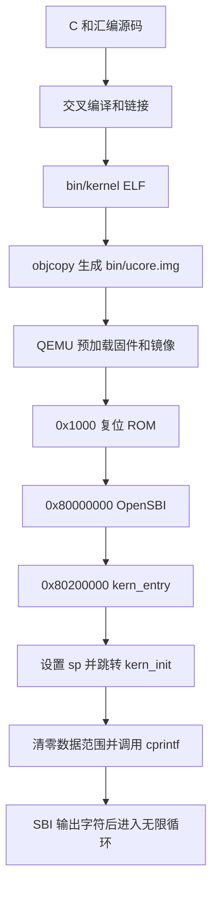

# 实验一：比麻雀更小的麻雀——最小可执行内核

姓名：李华濂  
验证日期：2026-09-30  
实验平台：QEMU `virt`，64 位 RISC-V  
源码目录：`lab1/`


## 一、实验目的与整体逻辑

本实验研究最小内核怎样获得控制权、建立基本 C 运行条件，并通过固件服务输出字符串。主要学习交叉编译、链接布局、启动交接、栈与调用约定、SBI 及 GDB 调试。

源码已经提供最小内核的主要功能，本次练习重点是解释入口汇编和验证启动流程。为适配当前环境并提高可靠性，补充了少量修正和自动检查；这些额外改动与练习答案分别说明。

整体逻辑分为三个阶段：

1. **构建**：将 C/汇编编译为 RISC-V 目标文件，再按链接脚本生成 ELF，最后转换为原始内核镜像。
2. **启动**：QEMU 建立虚拟机器并预加载镜像，虚拟 CPU 执行复位 ROM，进入 OpenSBI，再交接给内核。
3. **内核执行**：设置内核栈，进入 `kern_init`，清零数据范围，格式化输出，最后无限循环。



内核输出 `(THU.CST) os is loading ...` 是本实验的预期结果。输出后的无限循环用于保持内核执行，不代表系统已经具备进程调度或交互式 shell。

## 二、环境和复现方法

| 工具 | 本次版本/用途 |
| --- | --- |
| 宿主系统 | Ubuntu 24.04，x86_64 |
| Conda | `os2026`，管理辅助环境 |
| Python | 3.12.14，运行本地自检 |
| RISC-V GCC | 13.2.0，生成目标机器码 |
| QEMU | 8.2.2，模拟 RISC-V `virt` 平台 |
| OpenSBI | 默认固件 v1.3 |
| GDB | gdb-multiarch 15.1，支持 RISC-V |
| Make | 4.3，组织构建和检查 |

完整版本记录见 [versions.txt](docs/evidence/2026-09-30/versions.txt)。Conda 不取代系统模拟器和交叉编译器；GDB 位于环境内，编译器及 QEMU 复用系统安装，配置方法见 [环境说明](docs/环境配置.md)。

```bash
conda activate os2026
cd lab1
make grade
make qemu
```

`make grade` 是本次补充的本地自检入口，执行清理、重建、启动跟踪和输出测试，不是课程官方评分。QEMU 用 `Ctrl+A` 后松开并按 `X` 退出。

## 三、练习1：理解内核启动中的程序入口操作

### 3.1 `la sp, bootstacktop` 的操作与目的

[entry.S](kern/init/entry.S) 的入口首先执行：

```asm
la sp, bootstacktop
```

它将符号 `bootstacktop` 的地址放入栈指针寄存器 `sp`。此时不是读取栈中的数据，也不是动态分配栈，而是选择一块已经预留的内存作为内核栈。

栈空间在汇编的 `.data` 段中静态预留：

```asm
.align PGSHIFT
bootstack:
    .space KSTACKSIZE
bootstacktop:
```

[mmu.h](kern/mm/mmu.h) 给出 `PGSIZE = 4096`、`PGSHIFT = 12`，[memlayout.h](kern/mm/memlayout.h) 给出 `KSTACKPAGE = 2`，所以 `KSTACKSIZE = 8192` 字节。本平台汇编的 `.align 12` 对应 4096 字节对齐。

RISC-V 栈向低地址增长，初始栈指针位于预留范围的高地址边界。函数建立栈帧时先向低地址移动栈指针，再保存返回地址、局部数据或需要保留的寄存器。进入 C 函数之前必须准备有效栈，不能继续依赖固件使用过的栈。

本次符号结果如下，来源为 [symbols.txt](docs/evidence/2026-09-30/symbols.txt)：

```text
bootstack     = 0x80201000
bootstacktop  = 0x80203000
栈大小        = 0x2000 = 8192 字节
```

有效栈区是 `[0x80201000, 0x80203000)`。栈顶符号可以与紧邻其后的数据符号同地址；日志把该地址显示成 `SBI_CONSOLE_PUTCHAR` 时，并不代表栈指针设置错误，应核对地址和 `bootstacktop`。

`la` 是伪指令。本次 [反汇编](docs/evidence/2026-09-30/kernel-disassembly.txt) 为：

```asm
80200000: auipc sp,0x3
80200004: mv    sp,sp
```

第一条得到 PC 相对地址，第二条对应本次恰为零的低位调整。完整执行这两条后，GDB 观察到 `sp = 0x80203000`，与符号地址相同，且符合 16 字节栈对齐要求。不能只执行一次 `si` 就普遍认定整个 `la` 已完成。

### 3.2 `tail kern_init` 的操作与目的

接下来的指令是：

```asm
tail kern_init
```

它把控制流转移到 C 入口 `kern_init`，不为本次转移建立新的返回地址。与普通 `call` 相比，这种尾跳转不需要返回到入口汇编。

当前 `kern_init` 被声明为 `noreturn`，并在末尾执行 `while (1)`，符合不返回的设计。`noreturn` 只是向编译器说明性质，真正使执行不会返回的是函数实际控制流。

本次经过链接优化，`tail` 变成：

```asm
80200008: j 8020000a <kern_init>
```

GDB 实测，入口处和抵达 `kern_init` 时的 `ra` 都是 `0x8000ae9a`，没有被尾跳转改写；`pc` 到达 `0x8020000a`。因此，入口汇编完成了“建立自己的栈，再把执行交给 C 初始化函数”的职责。

## 四、练习2：使用 GDB 验证启动流程

### 4.1 调试方法

两个终端均激活环境并进入 `lab1`。终端一执行 `make debug`，终端二执行 `make gdb`。QEMU 的 `-S` 在启动时暂停 CPU，`-s` 提供 TCP 1234 调试端口，GDB 加载当前 `bin/kernel` 的符号并连接目标。

以下是可手动复现的观察命令：

```gdb
set pagination off
info registers pc
x/6i 0x1000
x/3i 0x80200000
si 5
info registers pc a0 a1 a2 t0
si
info registers pc
b *0x80200000
c
x/3i $pc
info registers pc sp ra
si 2
info registers sp
p/x &bootstacktop
si
info registers pc sp ra
```

本次验收由 [boot.gdb](tools/boot.gdb) 自动执行相同的关键观察、单步和断点，并附加断言。自检使用独立 Unix socket，避免与手工调试的 1234 端口冲突。真实记录保存在 [gdb-startup.log](docs/evidence/2026-09-30/gdb-startup.log)，不是根据教程截图填写的数据。

### 4.2 最初几条指令位于什么地址，完成什么功能

连接刚启动的目标后，实际观察到 `pc = 0x1000`。最初执行的是 QEMU 复位 ROM 中的六条指令：

| 地址 | 指令 | 主要作用 |
| --- | --- | --- |
| `0x1000` | `auipc t0,0x0` | 取得当前 PC 作为附近数据的寻址基准 |
| `0x1004` | `addi a2,t0,40` | 将固件动态信息地址 `0x1028` 放入 `a2` |
| `0x1008` | `csrr a0,mhartid` | 将当前 hart 标识传入 `a0` |
| `0x100c` | `ld a1,32(t0)` | 从 ROM 数据项读出设备树地址传入 `a1` |
| `0x1010` | `ld t0,24(t0)` | 读出下一阶段入口，当前为 `0x80000000` |
| `0x1014` | `jr t0` | 跳转到 OpenSBI |

这里 `ld a1,32(t0)` 读取的是该位置保存的地址值，不是把 `t0+32` 直接作为设备树地址。设备树用于描述模拟平台的硬件信息。

执行第六条指令后，观察到 `pc = 0x80000000`，同时 `a0 = 0`、`a1 = 0x87e00000`、`a2 = 0x1028`。这证明复位代码完成了参数准备和对 OpenSBI 的控制权交接。

`0x1000` 是本次 QEMU `virt` 的复位入口，不能推广成所有 RISC-V 芯片都必须使用的复位地址，也不能把这里的代码与 OpenSBI 主体混为一谈。

### 4.3 从 OpenSBI 到内核第一条指令

在 `0x80200000` 设置断点并继续运行后，GDB 停在 `kern_entry` 的第一条指令。观察结果如下：

| 阶段 | PC/关键状态 | 证据含义 |
| --- | --- | --- |
| 刚复位 | `pc = 0x1000` | CPU 尚在复位 ROM |
| 固件入口 | `pc = 0x80000000` | 复位代码已交给 OpenSBI |
| 内核入口 | `pc = 0x80200000`，`sp = 0x80046eb0` | 命中内核第一条指令，此时尚未设置自己的栈 |
| C 入口 | `pc = 0x8020000a`，`sp = 0x80203000` | 完成栈设置和尾跳转 |
| 格式化输出入口 | 命中 `cprintf` | C 初始化已经走到输出步骤 |

[QEMU 日志](docs/evidence/2026-09-30/qemu.log) 同时记录了 `Domain0 Next Address = 0x80200000`、`Domain0 Next Mode = S-mode`，以及最终的内核输出。这与断点结果相互印证。

### 4.4 对指导书观察点提示的说明

在 CPU 仍暂停于 `0x1000` 时，`x/3i 0x80200000` 已经能读到内核指令。这表明当前 `-kernel` 配置下，镜像由 QEMU 在 CPU 执行前预加载。

因此，在连接 GDB 后设置 `watch *0x80200000`，不一定能抓到加载瞬间，因为加载已发生。不能将观察点未触发推断为内核没有加载。正确做法是分别检查内存是否有镜像，以及 CPU 是否最终执行到入口。

## 五、核心函数和功能模块

### 5.1 构建与链接布局

Makefile 调用 `riscv64-unknown-elf-gcc` 编译 `.c/.S`，调用链接器并指定 [kernel.ld](tools/kernel.ld)，生成 `bin/kernel`，再用 `objcopy --strip-all -O binary` 生成 `bin/ucore.img`。

ELF 保存结构和调试信息，供 GDB 定位符号；原始镜像按本次约定加载到目标内存，不具有 ELF 那样的入口描述头。QEMU 读镜像与 GDB 读 ELF 必须对应同一次构建。

链接脚本以 `0x80200000` 为起点，依次安排代码、只读数据、可写数据等。`ENTRY(kern_entry)` 指定 ELF 入口符号；入口段排在最前面保证原始镜像开头确实是入口指令。当前脚本还通过 `KEEP` 和地址断言保持这个约束。

本次 [ELF 布局](docs/evidence/2026-09-30/elf-layout.txt)：

| 段/符号 | 地址或大小 | 含义 |
| --- | --- | --- |
| `.text` | 地址 `0x80200000`，大小 `0x4b8` | 内核代码 |
| `.rodata` | 地址 `0x802004b8`，大小 `0x270` | 字符串等只读数据 |
| `.data` | 地址 `0x80201000`，大小 `0x2000` | 当前主要是预留栈空间 |
| `.sdata` | 地址 `0x80203000`，大小 `8` | 保留的 SBI 服务号数据 |
| `edata/end` | 均为 `0x80203008` | 本次零初始化区间为空 |

`ALIGN(0x1000)` 是对齐到 4096 字节整数倍，不是“2 的 0x1000 次方”。链接脚本中的赋值发生在构建时，也不等于执行时内存已经加载。

### 5.2 `kern_init` 与零初始化

[init.c](kern/init/init.c) 引用链接器提供的 `edata`、`end`，用 `memset` 清零 `[edata, end)`。没有通用 C 运行库替内核执行这项初始化，因此需要显式处理。

本次链接结果中两个符号相等，日志记录清零范围为零字节。因此本次验证了边界和流程，未声称验证了非空 BSS 内容被清零。然后 `kern_init` 调用 `cprintf` 并进入无限循环。

### 5.3 从 `cprintf` 到 SBI 的输出链路

```text
cprintf → vcprintf → vprintfmt → cputch → cons_putc
        → sbi_console_putchar → sbi_call → ecall → OpenSBI 控制台
```

- [stdio.c](kern/libs/stdio.c)：接收变长参数、调用格式化器、计数输出字符。
- [printfmt.c](libs/printfmt.c)：解析格式符，将数值和字符串转换成逐个字符，再调用输出回调。
- [console.c](kern/driver/console.c)：封装控制台字符输出，隔离上层与固件接口。
- [sbi.c](libs/sbi.c)：将服务号及参数放入约定寄存器，执行 `ecall`。

格式转换和设备输出分离，使格式化代码不需要知道串口硬件细节。内核使用项目自带 `stdio.h` 与函数实现，不依赖宿主 Linux 的 libc。

本项目使用旧版 SBI 接口：`a7` 是服务号，字符输出服务号为 1，字符放在 `a0`，通用封装还准备 `a1/a2`，返回值取自 `a0`。`ecall` 触发同步异常，由本机配置的固件处理路径服务 S 模式请求，然后返回内核继续执行。普通函数调用没有这种受控特权交接。

SBI 是约定，OpenSBI 是固件实现。本次未运行 U 模式用户程序，也未实现完整用户态系统调用机制。

## 六、遇到的问题和实际修改

| 问题 | 修改 | 验证 |
| --- | --- | --- |
| 原 Makefile 的 loader 方式在本机 OpenSBI 下后续入口为零 | 使用 `-kernel bin/ucore.img` | 下一入口为 `0x80200000`，出现内核消息 |
| 原有 GDB 不支持 RISC-V | 使用环境内 `gdb-multiarch`，Makefile 允许覆盖 `GDB` | 能连接并反汇编 RISC-V 指令 |
| 入口位置不应依赖对象排列顺序 | 独立入口段、优先保留和链接断言 | 故意把入口对象放最后仍能启动 |
| 原 SBI 汇编未准确声明参数寄存器读写关系 | 绑定 `a0/a1/a2/a7` 并声明 `a0` 输入输出 | `-O0/-O2` 输出测试均通过 |
| 最小有符号 64 位整数直接有符号取负可能溢出 | 使用无符号取负得到绝对值 | 边界数值输出正确 |
| 原始资源缺少 `tools/grade.sh` | 增加本地自检脚本 | `make grade` 完成重建和检查 |

当前修改没有增加后续实验的内存分配、进程或中断处理任务，也没有为了本次练习重写已有输出库。新增输出测试使用独立测试内核，不覆盖正式的 `kern_init`。

## 七、验证结果及范围

本次实际执行 `make grade`，退出码为 0，主要结果为：

```text
PASS: reset -> OpenSBI -> kernel, stack/tail, BSS range, boot output
PASS: -O0 formatted output, character count, reordered entry object
PASS: -O2 formatted output, character count, reordered entry object
```

独立测试内核验证 `%s/%d/%u/%x/%p/%c/%%/%08x/%lld/%llu` 和返回字符数，包含 `-9223372036854775808`、`18446744073709551615` 两个边界值。分别见 [O0 日志](docs/evidence/2026-09-30/console-O0.log) 和 [O2 日志](docs/evidence/2026-09-30/console-O2.log)。

上述检查覆盖本次启动与输出需求，不证明整个格式化库的每个分支、输入接口、非空 BSS、所有固件版本或后续 OS 功能均正确。证据目录保存源代码和镜像摘要，方便对照本次测试版本。

## 八、实验知识与 OS 原理的关系和差异

| 知识点 | 原理中的含义 | 本实验对应实现与差异 |
| --- | --- | --- |
| 启动与控制权交接 | 从固件建立环境，再进入操作系统 | 复位 ROM、OpenSBI、内核三阶段；镜像由 QEMU 预加载，未实现磁盘引导器 |
| 栈与函数调用约定 | 管理函数执行现场和临时数据 | 静态栈、`sp`、`ra` 与尾跳转；没有线程栈切换 |
| 地址与内存布局 | 程序代码和数据有确定布局与生命周期 | 链接脚本及 BSS 边界；没有实现虚拟地址空间管理 |
| 特权级与异常 | 通过受控入口请求更高权限操作 | S 模式通过 SBI 请求 M 模式固件；未实现 U 模式系统调用 |
| 硬件抽象 | 上层使用稳定接口访问具体设备 | 格式化器、控制台和固件分层；未建立通用设备驱动框架 |
| 可执行文件与加载 | 可执行格式描述代码数据，加载器建立运行状态 | ELF 用于链接/调试，原始镜像用于当前启动；不是通用用户程序加载 |
| 调试与状态观察 | 将执行位置、寄存器和内存联系起来验证推断 | 通过 QEMU 远程调试；宿主 GDB 观察的是虚拟 CPU |

## 九、OS 原理中重要但本实验尚未对应实现的内容

1. **物理内存管理**：没有建立空闲页管理、页分配与回收算法。
2. **虚拟内存**：没有建立页表、地址空间隔离、缺页处理、按需分页或页面置换。
3. **进程和线程**：没有进程控制块、创建退出、调度和上下文切换。
4. **中断与异常处理框架**：使用 SBI 服务不等于内核已经实现时钟中断和完整陷阱分发。
5. **同步与通信**：没有实现锁、信号量、管道或其他进程间通信。
6. **文件系统与持久化**：没有实现文件、目录、磁盘块分配和缓存。
7. **用户环境与保护**：没有用户态程序、用户系统调用接口及完整权限隔离。

## 十、提示词记录与完成情况

准备材料要求保留提示词和验证过程，实际请求、规格化说明、采纳的修改和结果见 [提示词与验证记录](docs/提示词与验证记录.md)。这里如实区分用户请求与执行工具的自动验证，不把自动脚本运行写成个人手工操作。

| 交付要求 | 对应位置 |
| --- | --- |
| 练习1的两条指令与目的 | 第三节及符号/反汇编证据 |
| 练习2的启动过程、复位地址、指令功能 | 第四节及 GDB 日志 |
| 章节整体逻辑 | 第一节 |
| 核心函数和模块理解 | 第五节 |
| 重要知识、联系和差异 | 第八节 |
| 尚未对应实现的原理知识 | 第九节 |
| 提示词、代码与验证记录 | 文档、源码及证据目录 |
| Markdown 报告置于 lab1 | 本文件 |

代码和报告统一提交至 `hualian0927/os2026`，提交说明以“李华濂：”开头并描述实际完成内容。
