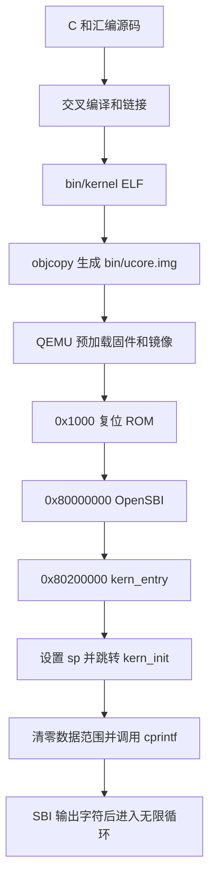

# 实验一：最小可执行内核

姓名：李华濂  
实验平台：QEMU `virt`，64 位 RISC-V  
实验验证日期：2026-09-30  
报告修订日期：2026-10-07

## 一、本章节的整体逻辑与实验目的

我对本章的理解是：它围绕“一个内核怎样开始运行并完成最基本的输出”展开，将平时由操作系统和运行库代为完成的准备工作显式展示出来。实验的重点不仅是看到一行输出，还要理解代码如何进入内存、CPU 如何到达内核入口、C 函数需要什么运行条件，以及内核如何获得字符输出能力。

首先，需要明确内核的内存布局和执行入口。内核不同于宿主 Linux 上的普通应用程序，不能直接依赖宿主系统的加载器和 C 运行库来安排运行条件。因此，本实验通过链接脚本约定各段的位置，将入口安排在 `0x80200000`，并通过交叉编译得到 RISC-V 可执行代码。这个阶段解决的是“准备什么代码，以及代码应该放在哪里”的问题。

其次，需要把构建结果和启动环境连接起来。QEMU 模拟 RISC-V 的 CPU、内存和外设，并在 CPU 执行前预加载 OpenSBI 固件与内核镜像。虚拟 CPU 从 `0x1000` 的复位 ROM 开始，经过参数准备后进入 `0x80000000` 的 OpenSBI，再由固件初始化环境并将控制权交给 `0x80200000` 的内核入口。这个阶段解决的是“谁先执行，以及怎样逐步交出控制权”的问题。

再次，内核入口汇编设置自己的栈指针，然后转入 C 语言编写的 `kern_init`。该函数处理零初始化范围，再调用格式化输出函数。由此可以看出，进入 C 函数并不意味着运行环境会自动建立，内核必须先满足栈和数据初始化等条件。

最后，本章从 OpenSBI 提供的字符输出服务出发，逐层封装控制台输出与格式化输出，形成可供内核调用的 `cprintf`。构建、运行和 GDB 调试把这些模块连接起来，使源码中的启动过程能够通过实际 PC、寄存器和输出结果得到验证。

因此，本章的逻辑可以概括为：约定布局与入口，构建镜像，完成固件到内核的交接，建立基本 C 运行条件，提供格式化输出，再通过调试验证全过程。最终内核打印 `(THU.CST) os is loading ...` 并进入无限循环，为后续实验提供最小的运行基础。



## 二、核心函数与功能模块的理解

### 2.1 交叉编译、Makefile 与内核镜像

交叉编译是指编译工具在宿主平台运行，而生成另一目标平台的机器码。本实验使用 `riscv64-unknown-elf-gcc`，在 x86_64 Linux 环境中生成 RISC-V 指令。Makefile 组织源文件依赖，依次完成编译、链接和镜像转换，避免每次手工输入完整构建命令。

构建首先把 C 和汇编源码转换为目标文件，再由链接器按照 `tools/kernel.ld` 生成 `bin/kernel`，最后用 `objcopy` 转换为 `bin/ucore.img`。其中，`bin/kernel` 是保留调试符号的 ELF 文件，GDB 利用它将地址对应到函数和源码；`bin/ucore.img` 是用于当前 QEMU 启动配置的原始二进制镜像。两者必须来自同一次构建，否则调试器所显示的源码位置可能与实际执行内容不一致。

原始二进制镜像没有 ELF 那样的入口和段描述头，其加载位置由启动配置约定。因此，链接时采用的布局必须与运行时的加载位置匹配。镜像文件以 `.img` 结尾，也不表示本实验一定通过虚拟硬盘或文件系统读取内核。

### 2.2 链接脚本与内存布局

`tools/kernel.ld` 的作用是把不同目标文件中的代码与数据组织成最终的内存布局。`.text` 存放代码，`.rodata` 存放只读数据，`.data` 和 `.sdata` 存放已初始化可写数据，`.bss` 用于零初始化数据。`ALIGN(0x1000)` 将后续布局对齐到 4096 字节整数倍。

`ENTRY(kern_entry)` 指定 ELF 入口符号，`. = BASE_ADDRESS` 则设置链接位置计数器。两者作用不同：指定入口符号并不自动保证入口机器码就是原始镜像最开始的内容，还需要把对应的输入段放到正确位置。当前实现将 `.text.kern_entry` 放在最前面，使用 `KEEP` 保留该段，并断言 `kern_entry` 等于 `0x80200000`。

链接器还提供 `edata`、`end` 等边界符号，使 C 代码能够根据实际布局计算初始化范围。这些符号不是 C 函数运行时申请出来的数组，而是构建阶段确定的地址。

### 2.3 汇编入口与 C 初始化函数

`kern/init/entry.S` 承接 OpenSBI 的控制权，主要完成两件事：将 `sp` 设置到内核栈顶，以及跳转到 `kern_init`。汇编入口保持简短，是因为这里需要直接控制寄存器，而更多初始化逻辑可以交给 C 代码表达。

`kern/init/init.c` 中的 `kern_init` 首先执行 `memset(edata, 0, end - edata)`，将链接器标识的零初始化范围清零。普通程序通常由加载器或运行库建立相关条件，这里则由内核自行处理。当前正式构建的 `edata` 与 `end` 均为 `0x80203008`，所以本次实际清零长度是零，不能把日志解释为已经验证非空 BSS 的清零效果。

随后，`kern_init` 调用 `cprintf` 输出启动信息，并通过 `while (1)` 保持执行。`noreturn` 向编译器说明该函数不会返回，真正决定不返回的是函数自身的控制流。这个循环尚不包含任务调度，也不意味着机器已经关闭。

### 2.4 格式化输出与控制台封装

`kern/libs/stdio.c` 中的 `cprintf` 接收格式串和变长参数，经 `vcprintf` 将格式化任务交给 `libs/printfmt.c` 中的 `vprintfmt`。`vprintfmt` 解析 `%s`、`%d` 等格式符，将对应内容转换为逐个字符，然后调用输出回调。数字格式化过程中，`printnum` 完成进制转换和逐位输出。

回调 `cputch` 输出字符并累计数量，`cons_putc` 将字符交给 `sbi_console_putchar`，后者通过 `sbi_call` 请求固件服务。这种分层把“生成什么字符”和“怎样把字符送到设备”分开，使格式化模块不需要理解串口硬件细节。

这里使用的是项目自带的 `stdio.h` 和输出函数，不是宿主 Linux 的 libc。内核本身正在建立运行环境，不能把宿主操作系统提供的 `printf` 当作已经存在的目标机服务。

### 2.5 SBI 调用与 OpenSBI

SBI 是监督者模式软件与机器模式固件之间的接口约定，OpenSBI 是该接口的一种实现。本实验的 uCore 运行在 S 模式，OpenSBI 运行在 M 模式。内核通过 `ecall` 触发同步异常，将服务请求交给当前配置下的固件处理路径。

当前源码使用旧版 SBI 控制台接口：`a7` 放服务号，字符输出服务号为 `1`，`a0` 放待输出字符，通用封装还准备 `a1`、`a2` 参数，返回值取自 `a0`。固件完成输出后返回内核，格式化过程继续处理下一个字符。

`sbi_call` 用内联汇编连接 C 与底层指令。当前实现显式绑定参数寄存器，并声明 `a0` 为输入和输出，使编译器能正确理解寄存器读写关系。这个调用经过特权级之间的受控处理，与普通 C 函数跳转不同。

## 三、实验练习与调试结果

### 3.1 练习1：理解内核启动中的程序入口操作

**问题一：`la sp, bootstacktop` 完成了什么操作，目的是什么？**

这条指令把 `bootstacktop` 的地址加载到栈指针寄存器 `sp`，使后续 C 函数使用内核自己预留的栈。它加载的是地址，不是栈中存放的数据，也没有在执行时动态申请栈空间。

栈空间由入口汇编中的 `.space KSTACKSIZE` 静态预留。根据 `kern/mm/mmu.h` 和 `kern/mm/memlayout.h`，每页大小为 4096 字节，内核栈占两页，总计 8192 字节。RISC-V 栈向低地址增长，因此初始栈指针指向高地址边界 `bootstacktop`，函数建立栈帧时再向低地址扩展。

设置栈的目的是满足 C 函数调用和局部数据保存的需要。C 函数可能在栈上保存返回地址、寄存器和临时变量，内核不能假设 OpenSBI 遗留的栈可以继续作为自己的运行栈。

本次 [符号记录](docs/evidence/2026-09-30/symbols.txt) 显示，`bootstack = 0x80201000`，`bootstacktop = 0x80203000`，两者相差 `0x2000`，与 8192 字节的定义一致。有效栈区为 `[0x80201000, 0x80203000)`。

`la` 是伪指令，当前构建中展开成两条机器指令：

```asm
0x80200000: auipc sp,0x3
0x80200004: mv    sp,sp
```

第一条获得 PC 相对地址，第二条对应本次为零的低位调整。两条执行后，GDB 观察到 `sp = 0x80203000`，与 `bootstacktop` 相等，并满足 16 字节对齐要求。这也说明单步调试时应以真实指令为准，不能假设一条源码伪指令只需要一次 `si`。

**问题二：`tail kern_init` 完成了什么操作，目的是什么？**

这条伪指令将控制流转移到 `kern_init`，不为本次转移建立新的返回地址。其目的是结束入口汇编的准备工作，把后续初始化交给 C 函数。由于 `kern_init` 不返回，不需要保留一个返回入口汇编的地址。

当前反汇编将其表现为位于 `0x80200008` 的 `j 0x8020000a <kern_init>`。调试记录显示，跳转前后 `ra` 都为 `0x8000ae9a`，而 `pc` 到达 `0x8020000a`。这一结果验证了尾跳转没有像普通 `call` 那样改写返回地址。

两条入口指令共同完成了从固件执行环境到内核 C 代码的衔接：先建立内核自己的栈，再转移到不返回的初始化函数。

### 3.2 练习2：使用 GDB 验证启动流程

**调试环境与方法。** 本次验证使用 Ubuntu 24.04、RISC-V GCC 13.2.0、QEMU 8.2.2、OpenSBI 1.3 和 gdb-multiarch 15.1，辅助工具环境为 Conda `os2026`。详细版本见 [版本记录](docs/evidence/2026-09-30/versions.txt)。

构建完成后，可在两个终端分别运行 `make debug` 和 `make gdb`。其中，QEMU 的 `-S` 使虚拟 CPU 在启动时暂停，`-s` 提供 TCP 1234 调试端口；GDB 加载 `bin/kernel` 中的符号并连接虚拟 CPU。下面的命令可复现关键观察：

```gdb
set pagination off
info registers pc
x/6i 0x1000
x/3i 0x80200000
si 5
info registers pc a0 a1 a2 t0
si
info registers pc
b *0x80200000
c
x/3i $pc
info registers pc sp ra
si 2
info registers sp
p/x &bootstacktop
si
info registers pc sp ra
```

**调试过程如下**
(base) lhl@lihua:~/os2026$ conda activate os2026
(os2026) lhl@lihua:~/os2026$ cd /home/lhl/os2026/lab1
(os2026) lhl@lihua:~/os2026/lab1$ make gdb
gdb-multiarch \
    -ex 'file bin/kernel' \
    -ex 'set arch riscv:rv64' \
    -ex 'target remote localhost:1234'
GNU gdb (Ubuntu 15.1-1ubuntu1~24.04.1) 15.1
Copyright (C) 2024 Free Software Foundation, Inc.
License GPLv3+: GNU GPL version 3 or later <http://gnu.org/licenses/gpl.html>
This is free software: you are free to change and redistribute it.
There is NO WARRANTY, to the extent permitted by law.
Type "show copying" and "show warranty" for details.
--Type <RET> for more, q to quit, c to continue without paging--c
This GDB was configured as "x86_64-linux-gnu".
Type "show configuration" for configuration details.
For bug reporting instructions, please see:
<https://www.gnu.org/software/gdb/bugs/>.
Find the GDB manual and other documentation resources online at:
    <http://www.gnu.org/software/gdb/documentation/>.

For help, type "help".
Type "apropos word" to search for commands related to "word".
Reading symbols from bin/kernel...
The target architecture is set to "riscv:rv64".
Remote debugging using localhost:1234
0x0000000000001000 in ?? ()
(gdb) set pagination off
(gdb) info registers pc
pc             0x1000   0x1000
(gdb) x/6i 0x1000
=> 0x1000:      auipc   t0,0x0
   0x1004:      addi    a2,t0,40
   0x1008:      csrr    a0,mhartid
   0x100c:      ld      a1,32(t0)
   0x1010:      ld      t0,24(t0)
   0x1014:      jr      t0
(gdb) 


2026-09-30 的实际验收由 `tools/boot.gdb` 自动执行同样的关键单步、断点和寄存器检查，并通过独立 Unix socket 连接，完整过程见 [GDB 日志](docs/evidence/2026-09-30/gdb-startup.log)。以上手动命令用于复现，所述测量值来自已保存的实际日志。

**问题：加电后最初执行的几条指令位于什么地址？** 刚连接目标时，观察到 `pc = 0x1000`，说明当前 QEMU `virt` 平台从这个复位地址开始执行。这里是复位 ROM，OpenSBI 主体位于 `0x80000000`，内核入口位于 `0x80200000`。这些是当前平台与配置下的地址，不代表所有 RISC-V 芯片都使用相同复位位置。

**问题：这些指令主要完成哪些功能？** 最初的六条指令依次执行以下操作：

1. `0x1000` 的 `auipc t0,0x0` 将当前 PC 放入 `t0`，作为访问附近数据的基准。
2. `0x1004` 的 `addi a2,t0,40` 将动态固件信息的地址 `0x1028` 放入 `a2`。
3. `0x1008` 的 `csrr a0,mhartid` 将当前硬件线程标识放入参数寄存器 `a0`。
4. `0x100c` 的 `ld a1,32(t0)` 从 ROM 附近的数据项中取出设备树地址，传入 `a1`。
5. `0x1010` 的 `ld t0,24(t0)` 读出下一阶段入口，本次为 `0x80000000`。
6. `0x1014` 的 `jr t0` 跳转到该地址，将控制权交给 OpenSBI。

因此，这段代码主要完成下一阶段所需的参数准备和控制流转移。尤其要区分“读出某个内存位置中保存的地址”和“把该内存位置本身当作地址”：这里的设备树地址来自 `ld` 的读取结果，而不是直接等于 `t0 + 32`。

**从固件到内核的观察。** 执行上述跳转后，日志显示 `pc = 0x80000000`，`a0 = 0`、`a1 = 0x87e00000`、`a2 = 0x1028`。随后在 `0x80200000` 设置断点并继续运行，GDB 停在 `kern_entry` 第一条指令，证明固件已经将执行权交给内核。

刚到内核入口时，`sp = 0x80046eb0`，还保留着固件阶段的值。执行栈初始化和尾跳转后，`sp` 变为 `0x80203000`，`pc` 到达 `kern_init` 的 `0x8020000a`，`ra` 保持不变。继续运行可到达 `cprintf`，最后看到内核启动消息。[QEMU 输出](docs/evidence/2026-09-30/qemu.log) 同时记录下一入口为 `0x80200000`、下一模式为 S 模式，与调试结果一致。

**对内核加载观察点的理解。** 在 CPU 仍暂停于 `0x1000` 时，`x/3i 0x80200000` 已能读取到内核指令。这说明当前启动方式由 QEMU 在 CPU 执行前预加载镜像。因此，连接后再设置 `watch *0x80200000` 不一定能捕获加载过程，不能据此判断内核没有加载。应分别验证镜像是否已在内存中，以及 CPU 是否真正运行到入口。

## 四、重要知识点与 OS 原理的联系和差异

### 4.1 启动与控制权交接

操作系统原理中的启动过程，是从硬件复位逐步建立运行条件，再进入操作系统的过程。本实验通过复位 ROM、OpenSBI 和内核入口展示这一逻辑，使“启动”从一个抽象事件变成可观察的 PC 变化。

二者的共同点是分阶段完成初始化并传递控制权。区别在于，本实验用 QEMU 预加载镜像，没有自行实现从磁盘查找和读取内核的引导程序，不能把这里的启动步骤直接等同于真实 PC 上完整的 UEFI、磁盘引导和系统加载过程。

### 4.2 栈、函数调用与执行现场

栈用于保存函数调用过程中的局部数据和部分执行现场，调用约定规定参数、返回地址及寄存器的使用方式。本实验通过 `sp` 初始化和 `tail` 展示 C 函数运行前必须满足的条件，并通过 `ra` 的变化理解普通调用与尾跳转的区别。

这一知识与后续线程上下文切换存在联系：线程也需要保存和恢复执行现场。但本实验只涉及一个内核启动流程中的函数转移，没有实现线程栈切换、调度或进程状态保存，不能把调用函数理解成切换进程。

### 4.3 内存布局与内存管理

程序内存布局描述代码、只读数据、可写数据和栈的地址关系。本实验通过链接脚本静态确定这些区域，并由内核处理零初始化范围，这体现了代码运行依赖具体内存安排。

它与 OS 内存管理的共同点是都需要明确地址、空间范围和使用规则；差异在于，链接布局主要在构建时确定，而操作系统的内存管理还要在运行时处理分配、回收、地址转换和保护。本实验预留一块栈不等于已经实现物理页分配或虚拟内存。

### 4.4 特权级、异常与服务调用

特权级用于区分软件可执行的操作范围，异常机制提供受控的处理入口。本实验中，S 模式内核通过 SBI 的 `ecall` 请求 M 模式固件完成服务，体现了上层软件不能任意直接执行更高权限操作的设计。

这一机制与用户程序通过系统调用请求内核服务有相似之处，都需要约定接口和受控转移。但本实验实际展示的是 S 模式到 M 模式的固件服务调用，没有运行 U 模式应用，也没有实现完整的用户态系统调用体系。`ecall` 引起的是同步异常，不能把它与异步的外设中断混为一谈。

### 4.5 硬件抽象与分层设计

操作系统通过抽象接口隔离应用逻辑和硬件细节。本实验把格式化、字符输出和 SBI 服务拆成不同层次：`vprintfmt` 处理内容，控制台封装处理字符通路，OpenSBI 处理底层服务。

其共同原理是降低模块之间的耦合，使上层不必依赖具体设备实现。但本实验仅完成一条简单输出通路，没有完整设备管理、缓冲区管理、异步 I/O 或通用驱动框架。

### 4.6 可执行文件、加载与调试

可执行文件格式提供程序布局等信息，加载过程将代码和数据放入运行位置。实验中的 ELF 与原始镜像分别用于符号调试和当前启动方式，使我理解“链接地址正确”“镜像已装入”和“CPU 正在执行”是三个需要分别验证的条件。

这与通用程序加载具有共同基础，但本实验没有实现一个支持任意用户程序的加载器。GDB 通过 QEMU 的远程调试接口观察虚拟 CPU，也不同于直接调试宿主 Linux 上的普通进程。

## 五、OS 原理中重要但本实验尚未对应实现的知识点

**物理内存分配与回收。** 操作系统需要记录空闲页和已用页，按照策略分配并回收内存。本实验只使用固定链接布局及预留栈，没有空闲页表或动态页分配算法。

**虚拟内存与地址空间隔离。** 页表、缺页处理、按需分页和页面置换使进程获得独立且受保护的地址空间。本实验尚未建立这些机制，也没有验证不同进程之间的访问隔离。

**进程、线程与调度。** 操作系统需要维护执行实体的状态，进行创建、阻塞、唤醒、退出和上下文切换。本实验只有启动后的单一执行流程，末尾无限循环不具备调度作用。

**完整的中断与异常处理。** 内核需要接收时钟和设备中断，识别异常原因，并保存和恢复现场。本实验调用了固件提供的 SBI 服务，但未实现完整的内核陷阱分发与中断管理框架。

**同步互斥和进程间通信。** 并发执行需要锁、信号量等同步机制，进程之间还可能通过管道、共享内存等方式通信。当前没有多任务并发，因此这些功能尚未体现。

**文件系统与持久化存储。** 文件、目录、磁盘块管理和缓存用于组织持久数据。本实验没有实现文件系统，加载一个原始内核镜像也不等于完成了文件管理。

**用户态运行与保护。** 完整操作系统还需要用户程序加载、权限检查、系统调用和资源回收。本实验的内核运行在 S 模式，尚未建立用户态程序的完整运行环境。

## 六、实验结果与问题分析

2026-09-30 保存的验证结果表明，内核能够完成交叉编译、链接和镜像转换，GDB 能跟踪复位 ROM、OpenSBI、内核入口与 C 初始化过程，最终出现预期启动消息。独立输出测试在 `-O0` 和 `-O2` 下通过，覆盖常用格式符、返回字符计数以及 64 位整数边界值，见 [验证证据](docs/evidence/2026-09-30/README.md)。本次报告修订沿用这些原始记录，没有将修订日期表述为新的运行日期。

实验准备中，原来的 loader 启动参数在本机固件下未传递正确的后续入口，改用 `-kernel bin/ucore.img` 后恢复正常；原 GDB 不支持 RISC-V，改用多架构 GDB 后可以调试。代码还补充了入口段位置约束、SBI 寄存器约束和整数格式化边界修正。它们改善了当前实现的兼容性和可靠性，详细内容保存在 [代码说明](docs/代码完成说明.md)。

`make grade` 是本项目补充的本地自检，不代表课程官方评分。现有结果证明已覆盖的启动和输出流程能够工作，但不能证明所有输入接口、所有格式化分支、非空 BSS 或后续 OS 模块都已正确实现。
