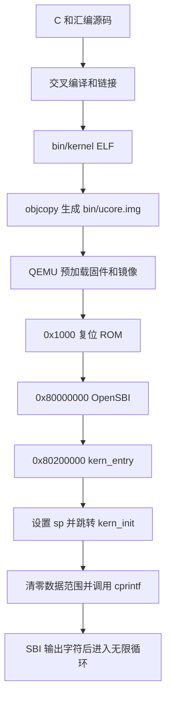
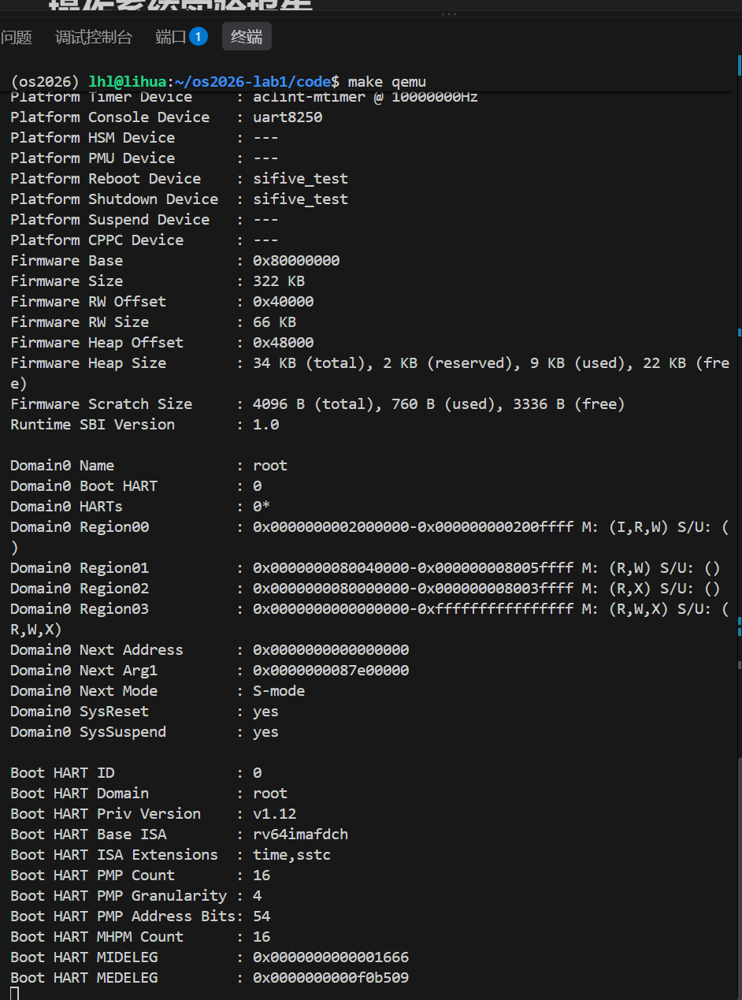

# 操作系统实验报告

## 实验基本信息

| 项目 | 内容 |
|------|------|
| **实验名称** | Lab 1：最小可执行内核 |
| **小组成员** | 2412351－李华濂 |
| **完成日期** | 2026-10-08（代码、文字验证及测试截图已整理） |
| **交付分支** | `lab1` |
| **目录结构** | `code/` 存放代码；`report/` 存放报告、提示词、截图和文本证据 |

### 小组分工

| 成员 | 负责的练习/模块 |
|------|----------------|
| 2412351－李华濂 | 练习一：入口汇编与栈初始化分析 |
| 2412351－李华濂 | 练习二：QEMU/GDB 启动跟踪、结果分析 |
| 2412351－李华濂 | 构建与输出验证、环境问题排查、报告整理及仓库提交 |

实验报告由 2412351－李华濂整理，测试截图由本人实际操作采集，共 11 张，已按测试步骤归档。

## 一、实验目的

1. 理解内核从复位 ROM、OpenSBI 到入口汇编和 C 初始化函数的启动过程。
2. 掌握交叉编译、链接脚本、ELF 调试文件及原始内核镜像之间的关系。
3. 理解 `la sp, bootstacktop` 和 `tail kern_init` 的作用，以及栈对 C 函数执行的意义。
4. 使用 GDB 观察指令、寄存器与断点，区分源码推导、实际运行结果和环境限制。
5. 理解 `cprintf` 经控制台封装与 SBI 输出字符的实现，并记录辅助工具的使用过程。

本实验的原始代码已经提供最小内核的主要功能。两道练习以阅读、调试和解释为主，不要求实现页分配、调度或文件系统。代码中的辅助修正与自检属于额外验证工作。

## 二、实验环境

| 成员 | AI 编程工具 | 底层模型 | 备注 |
|------|------------|---------|------|
| 2412351－李华濂 | Codex | GPT-5.6 sol | 按本人提供的信息填写，用于代码分析、排错与文档整理；不把工具输出直接等同于实验结论 |

| 环境或工具 | 本机配置 |
|------------|----------|
| 宿主系统 | Ubuntu 24.04，x86_64 |
| Conda | `os2026` 环境，Python 3.12.14 |
| 交叉编译器 | `riscv64-unknown-elf-gcc` 13.2.0 |
| 模拟器 | QEMU 8.2.2，`virt`，64 位 RISC-V |
| 固件 | QEMU 默认 OpenSBI 1.3 |
| 调试器 | `gdb-multiarch` 15.1，已验证支持 `riscv:rv64` |
| 构建工具 | GNU Make 4.3 |

版本输出见 [versions.txt](evidence/current/versions.txt)。本次沿用已安装的 GDB，没有另外安装或将它改名为 `riscv64-unknown-elf-gdb`。

**代码和启动配置的范围。** `code/Makefile` 与本地 `lab1.zip` 中的原版逐字节一致。其余代码沿用当前工作版本：入口段约束、SBI 寄存器约束和整数格式化边界修正仍保留，具体见第四节。不能把整个 `code/` 目录称为完全未修改的压缩包源码。

为回答“使用原始资源是否改变答案”，另外在临时目录完整解压 `lab1.zip`，未修改其中任何源文件，编译并调试。原版证据放在 [evidence/original/](evidence/original/)，本次交付代码的证据放在 [evidence/current/](evidence/current/)。两组结果严格区分。

**环境限制。** 原版 Makefile 写死了 `riscv64-unknown-elf-gdb`，所以本机 `make gdb` 报找不到命令，需直接执行已有的 `gdb-multiarch`。原版 `-device loader,...` 在当前默认固件下没有给出正确的后续内核入口；因此既记录原版启动失败，也使用独立的 `-kernel` 启动命令完成内核调试。后者没有改写 Makefile，属于明确标注的兼容性对照。

## 三、实验整体逻辑分析

### 3.1 本章节的逻辑主线

本章围绕“让一个最小内核开始运行，并具备打印信息的能力”展开。普通应用依赖操作系统和运行库准备执行环境，而内核要理解自己的代码放在哪里、谁把控制权交给自己、栈从何而来，以及怎样请求底层输出服务。

首先用交叉编译和链接脚本确定代码布局，生成 ELF 和原始镜像；随后由 QEMU 预加载镜像与固件；CPU 从复位 ROM 进入 OpenSBI；在后续入口配置正确时，OpenSBI 转入 uCore；最后由汇编建立内核栈并进入 C 初始化代码，打印消息后循环运行。

下面保留原报告的流程图。它描述入口配置正确时的预期流程；原版 Makefile 在本机的实测中断点位于 OpenSBI 到内核的交接阶段，不能把整张图当作原版配置已全部走通的证明。



### 3.2 功能的逐步实现

1. **约定布局并构建镜像。** 链接脚本以 `0x80200000` 为基址安排代码和数据；ELF 为 GDB 提供符号，原始镜像供 QEMU 加载。这一步解决“执行什么、放在哪里”。
2. **准备固件与控制权交接。** 复位 ROM 准备 hart ID、设备树指针及固件信息，再进入 OpenSBI。固件完成必要初始化后，按提供的后续入口转入 S 模式内核。
3. **建立基本 C 运行条件。** 入口汇编初始化 `sp`，然后尾跳转到 `kern_init`；C 代码通过链接符号确定零初始化范围。
4. **提供输出能力。** 格式化模块把参数转换为字符，控制台封装再通过 SBI 请求固件输出；成功后内核停留在无限循环。
5. **通过调试核对理解。** 分别检查镜像是否已经装入内存、CPU 是否真正到达入口、栈是否设置正确。不能把“看到了地址中的指令”当作“执行到了这里”。

## 四、实验内容与实现

### 功能模块：构建、入口与输出通路

**负责人：** 2412351－李华濂。

#### 模块功能描述

核心接口包括：

```c
int kern_init(void) __attribute__((noreturn));
int cprintf(const char *fmt, ...);
void cons_putc(int c);
void sbi_console_putchar(unsigned char ch);
uint64_t sbi_call(uint64_t sbi_type, uint64_t arg0,
                  uint64_t arg1, uint64_t arg2);
```

| 核心文件或模块 | 理解与职责 |
|----------------|------------|
| `Makefile` | 组织编译、链接、镜像转换和模拟器命令；工具名称和固件参数属于运行环境约定 |
| `tools/kernel.ld` | 安排 `.text`、`.rodata`、`.data`、`.sdata`、`.bss`，定义边界符号；`ENTRY(kern_entry)` 指定 ELF 入口，但不单独保证原始镜像开头的字节就是该符号 |
| `kern/init/entry.S` | 静态预留栈空间，运行时设置 `sp`，转入 `kern_init` |
| `kern_init` | 执行 `memset(edata, 0, end-edata)`，调用 `cprintf`，随后无限循环 |
| `cprintf`、`vcprintf`、`vprintfmt` | 处理变长参数和格式符，逐个产生字符；使用的是内核自己的实现，不是宿主 libc |
| `cputch`、`cons_putc` | 统计输出字符数并将字符送入控制台接口 |
| `sbi_console_putchar`、`sbi_call` | 按旧版 SBI 约定准备寄存器，通过 `ecall` 请求固件服务 |

输出链路为 `cprintf → vcprintf → vprintfmt → cputch → cons_putc → sbi_console_putchar → sbi_call → ecall → OpenSBI`。旧版控制台服务号为 `1`，放在 `a7`；字符通过 `a0` 传递。`ecall` 是同步异常入口，与普通函数跳转不同。

当前交付代码保留此前的三项辅助修正：入口使用独立 `.text.kern_entry` 段并由链接脚本保留和检查地址；SBI 内联汇编显式描述参数寄存器和 `a0` 的读写关系；有符号最小整数的格式化通过无符号取负避免有符号溢出。原始资源中入口使用 `.text`、链接脚本无额外 `KEEP` 和入口断言，SBI 使用显式 `mv`。这些实现差异不能误写成教材原本就有的代码。


#### 实现迭代过程

按可核验的工作过程整理为三个阶段，而不是虚构代码生成轮数：

1. **运行适配与功能核对。** 发现原版调试器命令与已安装工具不一致，以及 loader 启动方式未正确交接内核；此前曾通过修改启动参数和调试器名称完成启动验证，并补充上述代码修正。
2. **按要求恢复原版 Makefile。** Makefile 恢复为压缩包原样后，`make gdb` 的命令名问题与 loader 启动问题再次出现。这是配置恢复的结果，并非练习一指令语义发生变化。
3. **保留配置并区分验证条件。** 当前不修改 Makefile，直接调用 `gdb-multiarch`；原版启动结果和独立 `-kernel` 对照分别保存。直接执行 Python 自检可通过，但原版 `make grade` 因缺少 `check` 目标失败，如实记录。

最终结果：编译通过；兼容启动条件下的启动跟踪、栈/尾跳转及 O0/O2 输出验证通过；原版启动方式未完成固件到内核的交接。未宣称所有配置、所有测试均通过。

### 练习一：理解内核启动中的程序入口操作

**负责人：** 2412351－李华濂。

#### `la sp, bootstacktop` 完成什么操作，目的是什么？

它把符号 `bootstacktop` 的地址加载到栈指针 `sp`。加载的是地址，而不是该地址中的数据；栈空间由汇编中的 `.space KSTACKSIZE` 在构建时静态预留，并不是执行 `la` 时申请。

`PGSHIFT = 12`，页大小为 `4096` 字节；`KSTACKSIZE` 为两页，即 `8192` 字节。栈向低地址增长，初始 `sp` 指向高地址边界，为 C 函数保存返回地址、寄存器和局部数据提供空间。

原版源码和当前代码在本机编译后的关键符号一致：

```text
bootstack    = 0x80201000
bootstacktop = 0x80203000
栈区间        = [0x80201000, 0x80203000)
```

`la` 是伪指令，本次展开为：

```asm
0x80200000: auipc sp,0x3
0x80200004: mv    sp,sp
```

前一条用 PC 相对方式算出 `0x80203000`，后一条是本次低位偏移为零的调整。完整执行两条后，`sp = 0x80203000`，满足 16 字节对齐。其他构建应以实际反汇编为准，不能把伪指令数量当作机器指令数量。

#### `tail kern_init` 完成什么操作，目的是什么？

它把控制流转移到 `kern_init`，不为这次转移创建新的返回地址。入口准备工作已经结束，而 `kern_init` 最终进入无限循环，因此不需要返回入口汇编。

本次链接后，它表现为：

```asm
0x80200008: j 0x8020000a <kern_init>
```

兼容启动对照中，单步结果为：

```text
入口处：       pc = 0x80200000，sp = 0x80046eb0，ra = 0x8000ae9a
执行完整 la 后：sp = 0x80203000
执行 tail 后： pc = 0x8020000a，sp = 0x80203000，ra = 0x8000ae9a
```

`ra` 保持不变，验证了没有建立新的返回地址。`noreturn` 是对编译器的声明，实际不返回由函数控制流保证。

**与原版答案的比较：** 两条伪指令的作用、栈大小和本次入口布局均不变。上述动态结果来自明确使用 `-kernel` 的对照，原版 loader 启动未到达入口，不能声称在该失败流程中也实际执行了栈初始化。两组日志分别见 [原版镜像对照](evidence/original/gdb-kernel-control.log) 和 [当前代码对照](evidence/current/gdb-startup.log)。

### 练习二：使用 GDB 验证启动流程

**负责人：** 2412351－李华濂。

#### 调试方法和实际过程

进入 `code/` 后先执行 `make`。原版启动使用 `make debug`；另一终端不使用会报错的 `make gdb`，而是直接运行：

```bash
gdb-multiarch \
    -ex 'file bin/kernel' \
    -ex 'set arch riscv:rv64' \
    -ex 'target remote localhost:1234'
```

随后在 GDB 中观察：

```gdb
set pagination off
info registers pc
x/6i 0x1000
x/3i 0x80200000
si 5
info registers pc a0 a1 a2 t0
si
info registers pc
hbreak *0x80200000
continue
```

自动采集使用独立 Unix socket 替代 TCP 1234，避免占用已有调试会话；启动参数的其余关键部分相同。原版失败流程继续执行约 4 秒后，由采集程序发出中断并记录寄存器，不把等待超时伪装成测试通过。

#### 加电后最初执行的指令位于什么地址？

初始 `pc = 0x1000`，指向 QEMU `virt` 的复位 ROM；OpenSBI 主体入口为 `0x80000000`。这两个地址由当前虚拟平台决定，不是所有 RISC-V 硬件的统一固定地址。

```asm
0x1000: auipc t0,0x0
0x1004: addi  a2,t0,40
0x1008: csrr  a0,mhartid
0x100c: ld    a1,32(t0)
0x1010: ld    t0,24(t0)
0x1014: jr    t0
```

#### 这些指令主要完成哪些功能？

| 指令 | 本次观察中的作用 |
|------|------------------|
| `auipc t0,0x0` | 取得自身 PC，令 `t0 = 0x1000`，作为读取附近启动数据的基准 |
| `addi a2,t0,40` | 计算 `0x1000 + 0x28 = 0x1028`，向 `a2` 传入动态固件信息的地址 |
| `csrr a0,mhartid` | 读取硬件线程编号，本次 `a0 = 0` |
| `ld a1,32(t0)` | 从 `0x1020` 读取 64 位设备树指针，本次 `a1 = 0x87e00000` |
| `ld t0,24(t0)` | 用旧 `t0` 算出 `0x1018`，读取下一阶段地址并写回 `t0 = 0x80000000` |
| `jr t0` | 跳转到 OpenSBI，不写入新的返回地址；这个跳转本身不负责特权级切换 |

`x/6i` 表示要求 GDB 反汇编六条指令，不是自动判断代码总共只有六条。`0x1018` 开始存放下一阶段入口数据，继续用 `x/10i` 可能把数据解释为 `unimp` 等指令；应使用 `x/1gx 0x1018` 读取地址值，而不是推断 CPU 会顺序执行这些数据。

#### 原版 Makefile 的运行结果

初始六条指令及 `0x1000 → 0x80000000` 跳转均可观察。CPU 尚在复位 ROM 时，`0x80200000` 已能反汇编出内核入口，说明 QEMU 已预加载镜像。

但 OpenSBI 实际输出：

```text
Domain0 Next Address : 0x0000000000000000
```

在 `0x80200000` 设置断点后，本次观察未命中；中断运行时 `pc = 0x80000428`，仍在固件地址范围内，也未出现 uCore 启动消息。见 [原版参数 GDB 日志](evidence/current/gdb-loader.log) 和 [原版参数 QEMU 日志](evidence/current/qemu-original-makefile.log)。完全未修改的压缩包代码也出现同样情况，见 [原始代码记录](evidence/original/gdb-original.log)。

因此，练习二关于复位地址和最初指令作用的答案不变；“成功进入内核”的运行结论需要附上启动条件，不能沿用先前兼容配置的成功结论来描述原版配置。

#### 保持 Makefile 不变的兼容启动对照

停止原来的 QEMU 后，单独执行以下命令，用同一个镜像明确提供内核启动参数：

```bash
qemu-system-riscv64 -machine virt -nographic -bios default \
    -kernel bin/ucore.img -s -S
```

另一终端使用上述 `gdb-multiarch` 命令连接，然后执行：

```gdb
set pagination off
hbreak *0x80200000
continue
x/3i $pc
info registers pc sp ra
si 2
info registers sp
p/x &bootstacktop
si
info registers pc sp ra
detach
quit
```

对照中成功命中 `kern_entry = 0x80200000`，完成栈初始化并进入 `kern_init = 0x8020000a`；QEMU 显示后续入口为 `0x80200000`、下一模式为 S 模式，最终打印 `(THU.CST) os is loading ...`。详细证据见 [启动跟踪日志](evidence/current/gdb-startup.log) 与 [输出日志](evidence/current/qemu.log)。

这一对照不改变 Makefile，也没有安装另一套 GDB；它说明调试器能够正常观察内核，而原版加载参数与当前固件的交接才是另一个独立问题。

### Challenge

所给实验一材料没有单列必须完成的 Challenge。O0/O2 格式化输出检查属于辅助验证，不冒充课程额外练习或官方评分。

## 五、测试与验证

本轮已在交付分支的独立工作目录重新运行，结果如下：

| 检查 | 条件 | 实际结果与证据 |
|------|------|----------------|
| 编译、链接和镜像生成 | 保留原版 Makefile | 通过：[build.log](evidence/current/build.log) |
| 原版启动 | `make qemu`，loader 参数 | OpenSBI 下一入口为 0，未输出内核消息：[日志](evidence/current/qemu-original-makefile.log) |
| 原版调试器命令 | `make gdb` | 找不到 `riscv64-unknown-elf-gdb`：[日志](evidence/current/make-gdb.log)；直接运行 `gdb-multiarch` 可连接 |
| 原版评分入口 | `make grade` | 缺少 `check` 目标而失败：[日志](evidence/current/make-grade.log)；不能提交“make grade 通过”的截图 |
| 内核启动跟踪 | Python 脚本内部使用 `-kernel` 和 `gdb-multiarch` | 通过，复位、入口、栈、尾跳转与输出到达检查完成 |
| 格式化输出 | 独立测试内核，分别用 `-O0` 和 `-O2` 编译 | 通过，覆盖常用格式符、64 位整数边界及返回字符数 |

辅助验证命令为：

```bash
make
python3 tools/check_lab1.py --gdb gdb-multiarch
```

本次输出：

```text
PASS: reset -> OpenSBI -> kernel, stack/tail, BSS range, boot output
PASS: -O0 formatted output, character count, reordered entry object
PASS: -O2 formatted output, character count, reordered entry object
```

见 [自检汇总](evidence/current/local-check.log)、[O0 输出](evidence/current/console-O0.log) 和 [O2 输出](evidence/current/console-O2.log)。这不是课程官方评分。当前 `edata == end == 0x80203008`，清零长度为零，所以并未验证非空 BSS 清零。入口目标文件乱序测试只针对当前修正后的代码，不声称原始代码具备同样保证。

### 测试截图

以下 11 张图片均为本人提供的实际终端截图，按步骤命名保存，未修改图像内容。复现命令见 [截图操作清单](screenshots.md)。图 1～3 展示原版 Makefile 启动与复位跟踪；图 4～5 对应兼容启动下的内核验证；图 7～8 展示原版配置的限制，不能与兼容启动的成功结果混为一谈。内核入口和输出截图未展示完整启动命令，启动条件应结合前文复现命令和文本证据判断。

#### 图 1：编译、链接和镜像生成

先执行 `make clean`，再执行 `make`，可以看到各源文件编译、`ld` 链接及 `objcopy` 生成镜像，最后正常返回终端。


#### 图 2：启动调试与观察复位 ROM

终端 A 执行 `make debug` 后暂停等待 GDB。终端 B 使用现有 `gdb-multiarch` 连接，初始 PC 为 `0x1000`；六条复位指令与报告分析一致。`x/10i` 将后续数据误解为指令，而 `x/1gx 0x1018` 正确显示存放的地址 `0x80000000`。


#### 图 3：单步进入 OpenSBI

执行 `si 5` 后 `pc = 0x1014`、`t0 = 0x80000000`，再次 `si` 后 `pc = 0x80000000`，验证 `jr t0` 的跳转效果。


#### 图 4：内核入口、栈初始化与尾跳转

断点命中 `kern_entry = 0x80200000`。执行完整 `la` 后 `sp = bootstacktop = 0x80203000`；随后进入 `kern_init = 0x8020000a`，`ra` 保持 `0x8000ae9a`。两张截图共同对应练习一的动态验证。


#### 图 5：内核启动消息

图片直接展示 `(THU.CST) os is loading ...`，证明该次运行到达内核输出路径。此图仅截取输出尾部，未包含完整 QEMU 命令或 `Domain0 Next Address`；这些条件另见 [兼容启动日志](evidence/current/qemu.log)，不能仅凭此图断言原版 loader 参数运行成功。


#### 图 6：本地辅助自检

直接运行 `python3 tools/check_lab1.py --gdb gdb-multiarch`，启动跟踪、O0 输出和 O2 输出三项检查均为 PASS。脚本内部使用 `-kernel`；这不是课程官方评分或 `make grade` 成功结果。


#### 图 7：原版 loader 启动的实际限制

原版 `make qemu` 能启动 OpenSBI 1.3，但 `Domain0 Next Address` 为 `0`。上下两张画面展示同次启动的固件信息与后续入口，支持前文对固件到内核交接问题的分析。




#### 图 8：make grade 失败与直接自检通过的区别

`make grade` 因不存在 `check` 目标而退出。随后重新 `make` 构建，再直接执行 Python 自检，三项检查通过。这张截图同时保留失败和可行的验证方式，不能概括为“make grade 通过”。画面顶部较早的 `cd ./code` 路径错误发生在进入正确目录之前，与下方 `make grade` 缺少目标是两个独立问题。


## 六、实验总结与收获

### 对操作系统的理解

| 本实验知识点 | 对应 OS 原理、关系及差异 |
|--------------|-------------------------|
| 复位 ROM → 固件 → 内核 | 展示系统分阶段启动及控制权交接；本实验由 QEMU 预加载镜像，没有实现从磁盘查找和读取内核的引导程序 |
| 栈初始化与尾跳转 | 栈和调用约定为 C 执行提供基础；这里只切换到内核自己的初始栈，没有线程调度或进程上下文切换 |
| 链接脚本与各段布局 | 确定代码、数据和栈的位置；静态布局不等于运行时物理页分配、虚拟地址转换或内存保护 |
| SBI 与 `ecall` | 展示受控的特权服务请求；本实验是 S 模式内核请求 M 模式固件，不是 U 模式程序请求内核的完整系统调用体系 |
| 格式化与控制台分层 | 上层处理输出内容，下层处理输出通道，体现硬件抽象；尚无完整设备管理和异步 I/O 框架 |
| ELF、原始镜像与 GDB | 区分链接地址、装入地址和当前 PC；镜像存在于内存不代表 CPU 已执行它，也不能靠连接后设置观察点追溯此前的加载 |

OS 原理中重要但本实验尚未实现的内容包括：物理页分配与回收、页表和地址空间隔离、缺页处理与页面置换、进程和线程调度、内核中断/异常分发、同步互斥与进程通信、文件系统及用户态程序加载。本实验末尾的无限循环只保持内核不返回，不具备调度能力。

### AI 协作开发的经验

本次工作让我认识到，提示词必须明确代码版本、运行环境和允许修改的范围。仅要求“运行成功”容易把兼容性适配与原始实验代码混在一起；恢复原版配置后，更需要重新验证，而不能复用旧结论。

对工具生成的解释，我通过源码、反汇编、寄存器和实际日志相互核对。例如，`x/6i` 的 6 是观察数量，不能证明程序只有六条指令；`x/3i 0x80200000` 能显示内核，并不能证明 OpenSBI 已跳转到那里。

提示词和实际反馈按主题保存在 [prompt.md](prompt.md)。报告中保留失败条件、原始代码与当前代码的区别、测试覆盖边界以及实际测试截图，避免把辅助工具的推断写成已经发生的实验事实。
