# 操作系统实验报告

## 实验基本信息

| 项目 | 内容 |
|------|------|
| **实验名称** | Lab 1：最小可执行内核 |
| **小组成员** | 2412351－李华濂 、2412181-肖子昂|
| **完成日期** | 2026-10-09 |
| **实验分支** | `lab1` |

### 小组分工

| 成员 | 负责的练习/模块 |
|------|----------------|
| 2412351－李华濂 | 练习一：入口汇编与栈初始化分析 |
| 2412351－李华濂 | 练习二：QEMU/GDB 启动跟踪 |
| 2412351－李华濂 | 编译测试、环境配置、报告撰写与截图整理 |

本次实验的两个练习、报告和测试截图均由我负责。

## 一、实验目的

本次实验主要学习一个内核怎样开始运行。我希望通过阅读代码和单步调试，理解从 CPU 复位到内核打印第一行信息的过程，重点掌握以下内容：

1. 使用交叉编译工具和链接脚本构建 RISC-V 内核，理解 ELF 文件与二进制镜像的用途。
2. 理解复位 ROM、OpenSBI 和内核入口之间的执行顺序。
3. 说明 `la sp, bootstacktop` 和 `tail kern_init` 的作用，理解进入 C 函数前为什么需要设置栈。
4. 使用 GDB 查看指令、寄存器和断点，验证启动流程。
5. 理解格式化输出如何通过控制台接口和 SBI 服务完成。

这两个练习主要是阅读代码、观察运行过程和解释结果。本次没有涉及进程调度、页分配或文件系统的实现。

## 二、实验环境

| 成员 | AI 编程工具 | 底层模型 | 用途 |
|------|------------|---------|------|
| 2412351－李华濂 | Codex | GPT-5.6 sol | 辅助阅读汇编、分析调试信息及排查环境问题 |
| 2412181－肖子昂 | Codex | GPT-5.6 terra | 调试环境、测试代码 |

| 环境或工具 | 配置 |
|------------|------|
| 宿主系统 | Ubuntu 24.04，x86_64 |
| Conda 环境 | `os2026`，Python 3.12.14 |
| 交叉编译器 | `riscv64-unknown-elf-gcc` 13.2.0 |
| 模拟器 | QEMU 8.2.2，`virt`，64 位 RISC-V |
| 固件 | OpenSBI 1.3 |
| 调试器 | `gdb-multiarch` 15.1 |
| 构建工具 | GNU Make 4.3 |

我使用 `gdb-multiarch` 调试 QEMU 中的 RISC-V 内核。Makefile 已将 `make gdb` 对应的程序设置为该调试器，并通过 `-kernel bin/ucore.img` 启动内核。

**激活 `os2026` 并进入 `code/` 后，可以直接执行 `make` 编译，在终端一执行 `make debug`，再在终端二执行 `make gdb` 进行调试。** 不需要手工输入完整的 QEMU 或 GDB 启动参数。只查看运行结果时执行 `make qemu`。

终端一：

```bash
conda activate os2026
cd /home/lhl/os2026-lab1/code
make
make debug
```

终端二：

```bash
conda activate os2026
cd /home/lhl/os2026-lab1/code
make gdb
```

`make debug` 使用 `-S` 让 CPU 暂停在启动位置，使用 `-s` 开放 1234 调试端口。因此，这个命令启动后暂时没有输出是正常现象。GDB 连接后再通过单步或 `continue` 控制执行。调试命令应在两个终端运行，不能在被 QEMU 占用的终端中接着输入 `make gdb`。

## 三、实验整体逻辑分析

### 3.1 本章节的逻辑主线

我对本章的理解是：先让代码具备可以执行的布局，再完成从固件到内核的交接，最后建立最基本的 C 运行环境和输出能力。

普通程序启动时，操作系统和运行库已经准备了许多条件。内核则需要明确自己的入口地址、栈空间和数据范围。本实验将这些准备工作集中在链接脚本、入口汇编和 `kern_init` 中，代码量虽然不大，但可以观察到一个操作系统开始运行的基本过程。

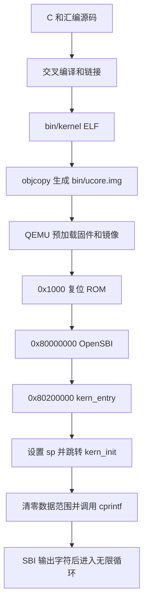

### 3.2 功能的逐步实现

首先，交叉编译器把 C 和汇编代码转换为 RISC-V 目标文件。链接器按照 `tools/kernel.ld` 安排代码、数据和栈的位置，生成带有符号信息的 `bin/kernel`，随后由 `objcopy` 得到 `bin/ucore.img`。前者供 GDB 识别函数和变量，后者供 QEMU 加载。

接着，QEMU 在 CPU 执行前将固件和镜像放入内存。CPU 从 `0x1000` 的复位 ROM 开始，准备参数后跳转到 `0x80000000` 的 OpenSBI。OpenSBI 完成初始化，再将控制权交给位于 `0x80200000` 的内核入口。

进入内核后，`entry.S` 先设置 `sp`，再跳转到 `kern_init`。这样安排是因为后续 C 函数可能需要在栈上保存寄存器、返回地址和局部数据。

最后，`kern_init` 处理零初始化范围，调用 `cprintf` 输出启动消息，然后进入无限循环。输出过程从格式串解析逐层进入字符输出接口，最终由 OpenSBI 完成底层输出。

## 四、实验内容与实现

### 功能模块：构建、入口和输出

**负责人：** 2412351－李华濂。

#### 模块功能描述

阅读代码时，我重点分析了以下接口：

```c
int kern_init(void) __attribute__((noreturn));
int cprintf(const char *fmt, ...);
void cons_putc(int c);
void sbi_console_putchar(unsigned char ch);
uint64_t sbi_call(uint64_t sbi_type, uint64_t arg0,
                  uint64_t arg1, uint64_t arg2);
```

| 核心文件或函数 | 我的理解 |
|----------------|----------|
| `Makefile` | 管理编译依赖，调用编译器、链接器、QEMU 和 GDB，将常用操作组织成 `make` 目标 |
| `tools/kernel.ld` | 设置基址和各段布局；通过入口段顺序及地址断言保证 `kern_entry` 位于 `0x80200000` |
| `kern/init/entry.S` | 预留内核栈，设置栈指针并转入 C 初始化函数 |
| `kern_init` | 清零链接符号给出的数据范围，输出启动信息，最后无限循环 |
| `cprintf`、`vcprintf`、`vprintfmt` | 接收变长参数并解析格式串，将数据转换为待输出的字符 |
| `cputch`、`cons_putc` | 统计字符数量，将字符交给控制台输出接口 |
| `sbi_console_putchar`、`sbi_call` | 准备 SBI 参数，通过 `ecall` 请求固件输出字符 |

链接脚本中的 `ENTRY(kern_entry)` 指定 ELF 入口，段的排列则决定机器码在镜像中的实际位置。这两件事需要同时满足。`.text` 存放代码，`.rodata` 存放只读数据，`.data` 和 `.sdata` 存放可写数据，`.bss` 表示需要零初始化的数据范围。

`kern_init` 使用 `memset(edata, 0, end - edata)` 处理零初始化范围。本次构建中，`edata` 与 `end` 都是 `0x80203008`，因此实际长度为零。这里可以核对范围的计算，但还没有通过非空数据区验证清零效果。

输出的调用顺序为：

```text
cprintf → vcprintf → vprintfmt → cputch → cons_putc
        → sbi_console_putchar → sbi_call → ecall → OpenSBI
```

`vprintfmt` 负责解析格式符和转换数字，不直接操作串口。SBI 控制台接口把服务号 `1` 放在 `a7`，把字符放在 `a0`，再执行 `ecall`。这使我理解了格式化逻辑与硬件输出之间的分层关系。

#### 实现与调试过程

我在实验中遇到的问题主要集中在构建和启动配置。调试器命令与已安装的程序名称不一致时，`make gdb` 无法启动；将其设置为 `gdb-multiarch` 后，能够正常连接 QEMU。启动参数使用 `-kernel` 后，OpenSBI 能得到正确的后续入口并进入内核。

此外，入口代码使用独立的 `.text.kern_entry` 段，链接脚本通过 `KEEP` 和地址断言保证入口位置；SBI 内联汇编明确描述了参数寄存器和 `a0` 的读写关系；整数格式化使用无符号取负处理最小有符号整数的绝对值。这些修改分别对应入口布局、编译器寄存器约束和整数边界问题。

测试入口也统一到 Makefile 中：`make check` 执行本地自检，`make grade` 先清理再重新构建并运行自检。修改后已重新检查编译、启动、GDB 单步和格式化输出，结果见第五节。

### 练习一：理解内核启动中的程序入口操作

**负责人：** 2412351－李华濂。

#### `la sp, bootstacktop` 完成什么操作，目的是什么？

这条指令将 `bootstacktop` 的地址加载到栈指针 `sp`。这里加载的是符号地址，而不是该地址中保存的数据。调试时，我将 `sp` 和 `&bootstacktop` 进行比较，验证了这一点。

栈空间由 `.space KSTACKSIZE` 静态预留。`PGSHIFT = 12`，一页为 4096 字节；内核栈占两页，共 8192 字节。RISC-V 栈向低地址增长，因此初始 `sp` 指向栈的高地址边界。

本次符号地址为：

```text
bootstack    = 0x80201000
bootstacktop = 0x80203000
栈区间        = [0x80201000, 0x80203000)
```

`la` 是伪指令，在本次反汇编中展开为：

```asm
0x80200000: auipc sp,0x3
0x80200004: mv    sp,sp
```

第一条通过 PC 相对计算得到 `0x80203000`，第二条对应本次为零的低位调整。执行 `si 2` 后，我观察到 `sp = 0x80203000`，与 `bootstacktop` 相等，也满足 16 字节对齐。

设置 `sp` 的目的是为 C 函数提供可用的内核栈。函数可能需要保存寄存器、返回地址和临时数据，因此应先设置栈，再进入 `kern_init`。

#### `tail kern_init` 完成什么操作，目的是什么？

`tail kern_init` 将控制流转移到 `kern_init`，不会为这次转移创建新的返回地址。入口汇编完成栈设置后，后续初始化由 C 函数负责；`kern_init` 最终进入无限循环，不需要返回入口汇编。

本次链接后，这条伪指令表现为：

```asm
0x80200008: j 0x8020000a <kern_init>
```

调试中观察到：

```text
入口处：       pc = 0x80200000，sp = 0x80046eb0，ra = 0x8000ae9a
执行完整 la 后：sp = 0x80203000
执行 tail 后： pc = 0x8020000a，sp = 0x80203000，ra = 0x8000ae9a
```

`pc` 已到达 `kern_init`，而 `ra` 保持不变，符合尾跳转的作用。`noreturn` 用于告诉编译器该函数不会返回，函数末尾的无限循环则保证了实际控制流不会返回。

### 练习二：使用 GDB 验证启动流程

**负责人：** 2412351－李华濂。

#### 调试过程

按第二节的方法运行 `make`、`make debug` 和 `make gdb` 后，在 GDB 中依次执行：

```gdb
info registers pc
x/6i 0x1000
x/1gx 0x1018
x/3i 0x80200000
si 5
info registers pc a0 a1 a2 t0
si
info registers pc
hbreak *0x80200000
continue
x/3i $pc
info registers pc sp ra
si 2
info registers sp
p/x &bootstacktop
si
info registers pc sp ra
```

调试结束后输入 `detach` 让内核继续运行，再输入 `quit` 退出 GDB。此时 QEMU 终端会显示内核启动消息。退出 QEMU 时，按 Ctrl+A，松开后按 X。

#### 加电后最初执行的指令位于什么地址？

刚连接时，GDB 显示 `pc = 0x1000`，说明 CPU 从该地址的复位 ROM 开始执行。这里与 `0x80000000` 的 OpenSBI 入口、`0x80200000` 的内核入口是三个不同的位置。

这些地址对应本实验使用的 QEMU `virt` 平台，并不表示所有 RISC-V 处理器都有相同的复位地址。

```asm
0x1000: auipc t0,0x0
0x1004: addi  a2,t0,40
0x1008: csrr  a0,mhartid
0x100c: ld    a1,32(t0)
0x1010: ld    t0,24(t0)
0x1014: jr    t0
```

#### 这些指令主要完成哪些功能？

| 指令 | 作用及观察结果 |
|------|----------------|
| `auipc t0,0x0` | 把该指令的 PC 放入 `t0`，得到基准地址 `0x1000` |
| `addi a2,t0,40` | 计算 `0x1000 + 0x28 = 0x1028`，将动态固件信息的地址放入 `a2` |
| `csrr a0,mhartid` | 读取硬件线程编号，本次 `a0 = 0` |
| `ld a1,32(t0)` | 从 `0x1020` 读取设备树指针，本次为 `0x87e00000` |
| `ld t0,24(t0)` | 从 `0x1018` 读取下一阶段地址，得到 `t0 = 0x80000000` |
| `jr t0` | 跳转到 OpenSBI；不创建新的返回地址，这条跳转本身也不切换特权级 |

因此，这段代码主要完成启动参数的准备和向 OpenSBI 的跳转。其中 `ld` 读出的是内存位置保存的地址，结果并不等于访存位置本身。

#### 观察结果与分析

执行前五条指令后，`pc = 0x1014`、`t0 = 0x80000000`。再执行一次 `si`，PC 变为 `0x80000000`，说明跳转已经发生。

随后在 `0x80200000` 设置断点并继续运行，GDB 停在 `kern_entry` 的第一条指令。执行栈初始化后，`sp` 从固件阶段的值变为 `0x80203000`；执行尾跳转后，进入 `kern_init = 0x8020000a`。这与练习一对两条伪指令的分析一致。

继续执行后，内核输出 `(THU.CST) os is loading ...`。OpenSBI 的启动信息中，后续入口为 `0x80200000`，下一模式为 S 模式。完整记录见 [GDB 调试日志](evidence/2026-10-09/make-gdb.log) 和 [QEMU 启动日志](evidence/2026-10-09/make-debug-qemu.log)。

调试中还有两点值得记录。第一，`x/6i` 的 6 是要求显示的指令数量。继续使用 `x/10i` 时，GDB 会把后续地址数据也当作指令解释，所以出现 `unimp` 不代表 CPU 实际执行了非法指令。使用 `x/1gx 0x1018` 可以看到这里保存的是 `0x80000000`。

第二，CPU 仍停在 `0x1000` 时，已经可以查看 `0x80200000` 的内核指令，说明镜像在 CPU 执行前就已由 QEMU 放入内存。查看到指令和执行到该位置是两件事；前者用内存查看命令确认，后者需要观察 PC 或断点。

## 五、测试与验证

完成配置调整后，于 2026-10-09 重新运行了以下检查：

| 检查内容 | 命令或方法 | 结果 |
|----------|------------|------|
| 编译、链接和镜像生成 | `make clean`、`make` | 通过，[编译记录](evidence/2026-10-09/build.log) |
| 内核启动 | `make qemu` | 输出启动消息，[运行记录](evidence/2026-10-09/make-qemu.log) |
| 双终端调试 | `make debug`、`make gdb` | 连接成功，完成入口、栈及尾跳转检查，[调试记录](evidence/2026-10-09/make-gdb.log) |
| 清理后完整自检 | `make grade` | 通过，[自检记录](evidence/2026-10-09/make-grade.log) |
| 格式化输出 | 分别以 `-O0`、`-O2` 编译独立测试内核 | 格式化内容和返回字符数正确 |

`make grade` 调用本实验配套的本地自检脚本，不是课程官方评分。输出中的三项结果为：

```text
PASS: reset -> OpenSBI -> kernel, stack/tail, BSS range, boot output
PASS: -O0 formatted output, character count, reordered entry object
PASS: -O2 formatted output, character count, reordered entry object
```

格式化测试覆盖字符串、十进制和十六进制整数、指针、字符、补零宽度以及 64 位整数边界，记录见 [O0 输出](evidence/2026-10-09/console-O0.log) 和 [O2 输出](evidence/2026-10-09/console-O2.log)。本次没有覆盖非空 BSS 清零、所有输入接口和全部格式化分支。

### 5.1 编译结果

我先清理构建文件，再重新编译。截图中可以看到源文件编译、内核链接和镜像生成均正常完成。

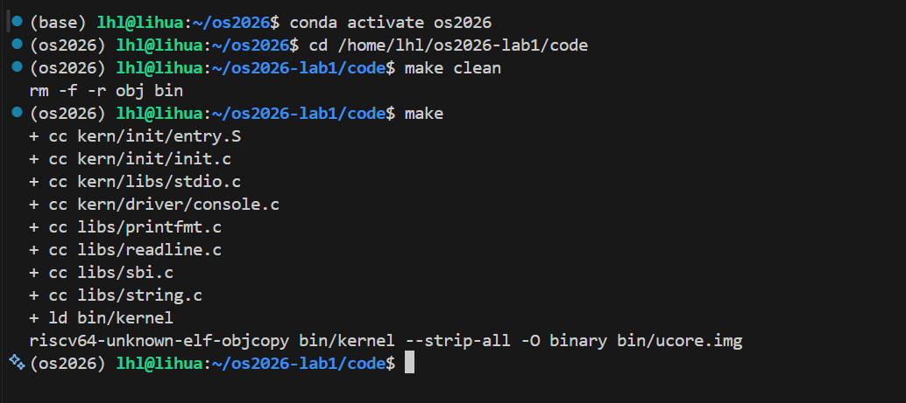

### 5.2 复位 ROM 与 OpenSBI

执行 `make debug` 后，QEMU 暂停等待连接。截图中的 GDB 使用完整命令启动；现在这些参数已写入 Makefile，可以直接执行 `make gdb`。

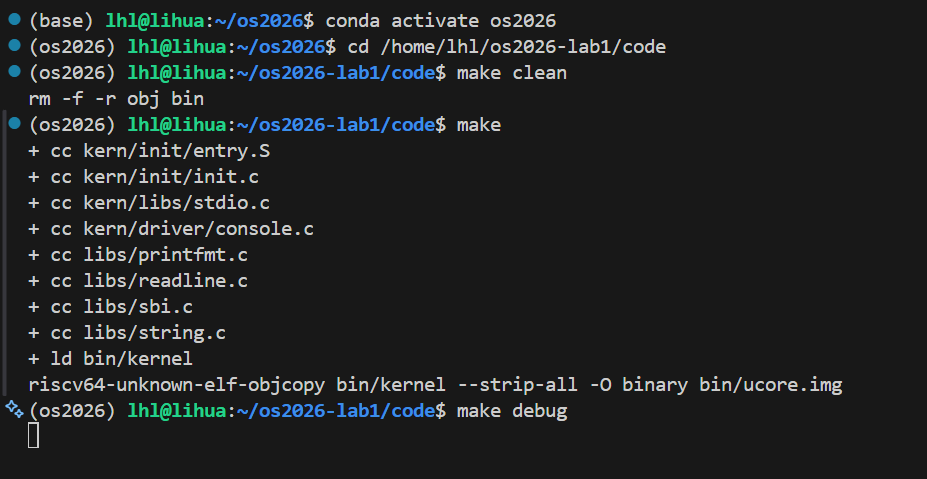

连接后初始 PC 为 `0x1000`，六条指令和 `0x1018` 中保存的入口地址与分析一致。

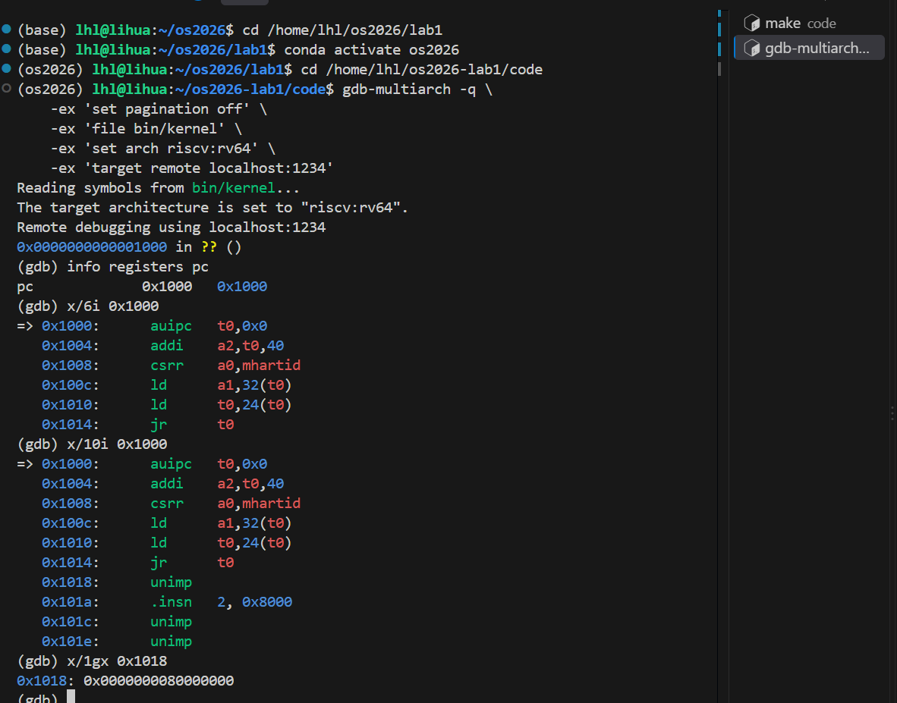

单步执行跳转后，PC 到达 `0x80000000`。

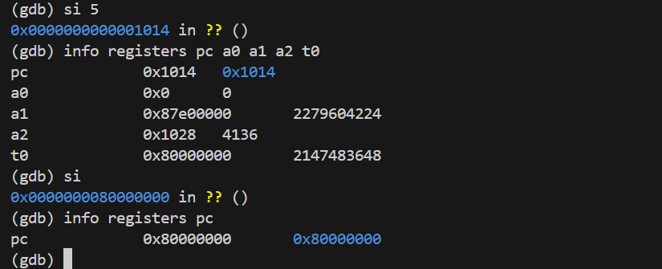

### 5.3 内核入口与栈

在内核入口命中断点时，`sp` 尚保留固件阶段的值。

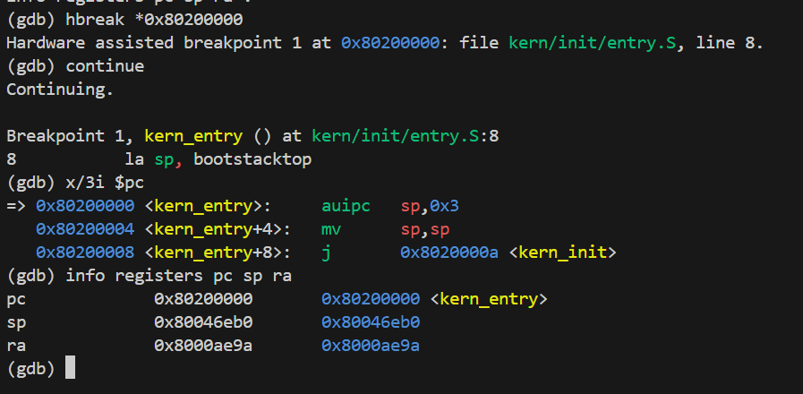

执行 `la` 和 `tail` 后，`sp` 等于 `bootstacktop`，PC 到达 `kern_init`，`ra` 未改变。

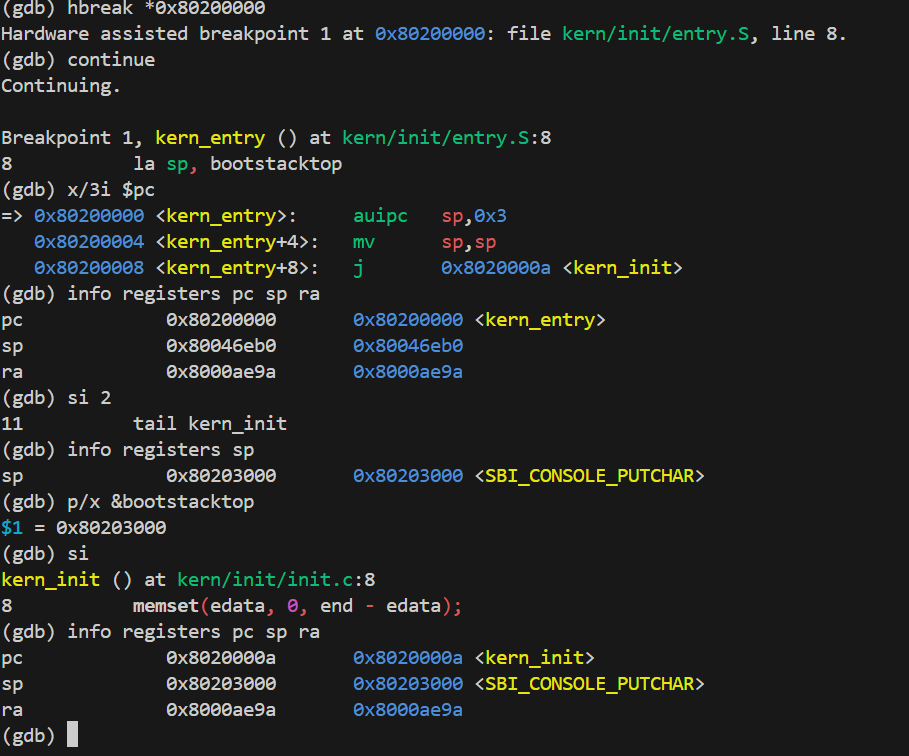

### 5.4 内核输出与自检

继续运行后，终端显示内核启动消息。

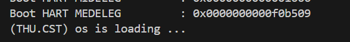

截图中的自检通过直接运行 Python 脚本完成。目前也可以用 `make check` 调用该脚本，或用 `make grade` 清理、构建后执行。两种方式检查的项目相同。

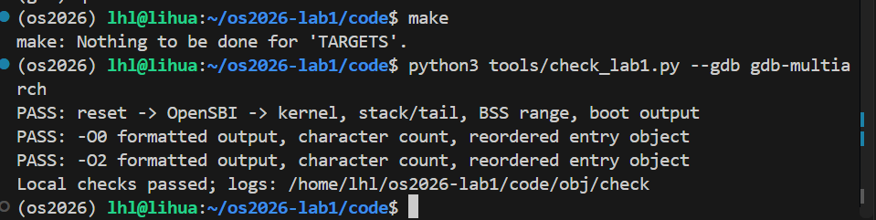

### 5.5 调试中遇到的问题及处理

配置过程中曾出现 OpenSBI 已启动、内核却没有输出的情况。检查启动信息后发现 `Domain0 Next Address` 为 0。将 QEMU 参数设置为 `-kernel bin/ucore.img` 后，后续入口变为 `0x80200000`，能够进入内核。以下两张截图记录了当时的问题。

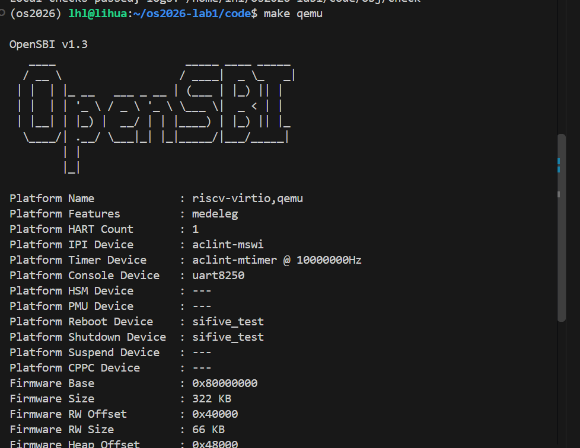


另外，`make grade` 曾因缺少 `check` 目标而失败。截图记录了报错后重新构建、直接执行 Python 自检的过程。现在 Makefile 已补充 `check` 目标，重新运行 `make grade` 后通过，结果见本节表格中的自检记录。

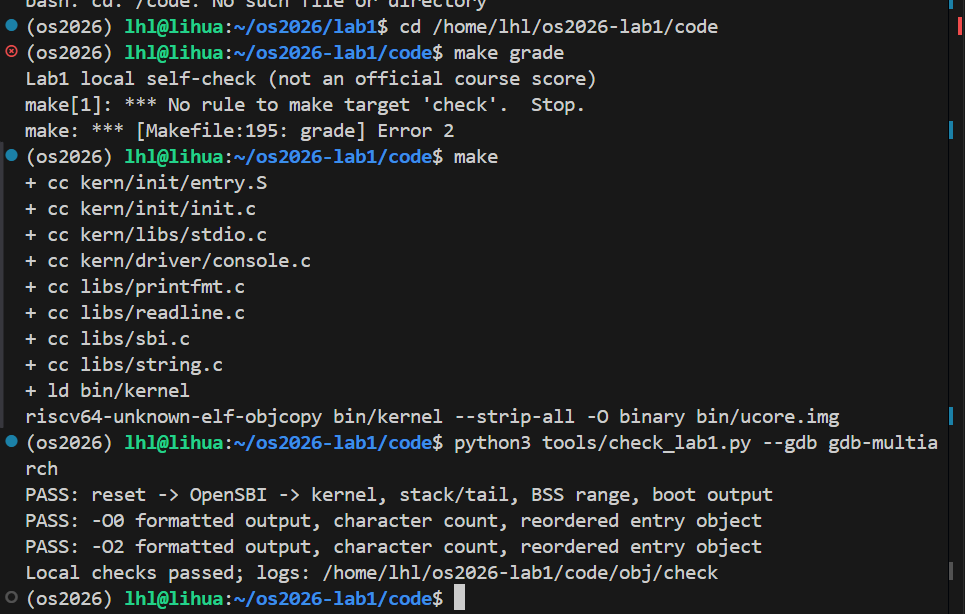

## 六、实验总结与收获

### 对操作系统的理解

通过这次实验，我对“内核启动”有了更具体的认识。它包含镜像布局、固件初始化、控制权转移、栈设置和数据初始化等步骤。只有这些条件准备好，C 代码中的输出函数才能正常执行。

| 实验中的知识点 | 对应 OS 原理及联系、差异 |
|----------------|-------------------------|
| 分阶段启动 | 复位 ROM、固件和内核逐步交接控制权；本实验由 QEMU 预加载镜像，没有实现磁盘引导程序 |
| 栈与函数调用 | 栈保存局部数据和部分执行现场，调用约定规定寄存器用途；本实验的尾跳转属于函数控制流转移，没有进行进程切换 |
| 链接布局与内存管理 | 链接脚本确定代码、数据和栈的位置；运行时的页分配、地址转换和内存保护还需要另外实现 |
| 特权级与异常 | 内核通过 `ecall` 请求固件服务，体现受控的特权级交互；这里是 S 模式到 M 模式的服务调用，尚未建立用户态系统调用体系 |
| 输出分层 | 格式化代码产生字符，控制台和固件处理输出通道；本实验只完成简单输出，没有完整设备管理和异步 I/O |
| 加载与执行 | 链接地址、镜像装入地址和当前 PC 含义不同；镜像位于内存中，并不表示 CPU 已经执行到它 |

操作系统原理中还有一些重要内容没有在本实验中实现，包括物理页分配与回收、虚拟内存和页表、缺页处理、进程与线程调度、中断管理、同步互斥、进程通信、文件系统和用户程序加载。内核最后的无限循环只是让程序保持运行，并不是调度器。

### AI 协作开发的经验

我使用 Codex 辅助解释汇编指令和分析报错，再结合代码与实际调试结果检查解释是否正确。比如，开始时我不清楚为什么只看六条指令，也没有区分“查看某个地址”和“执行到某个地址”。通过修改 GDB 查看数量、读取地址数据和设置断点，这些问题才逐渐清楚。

这次实验也让我认识到，工具名称、启动参数和编译结果都需要在自己的环境中验证。遇到运行问题时，应先确认是哪一步没有完成，再查看相应的命令和寄存器，而不是只根据有没有打印消息判断内核代码是否正确。
